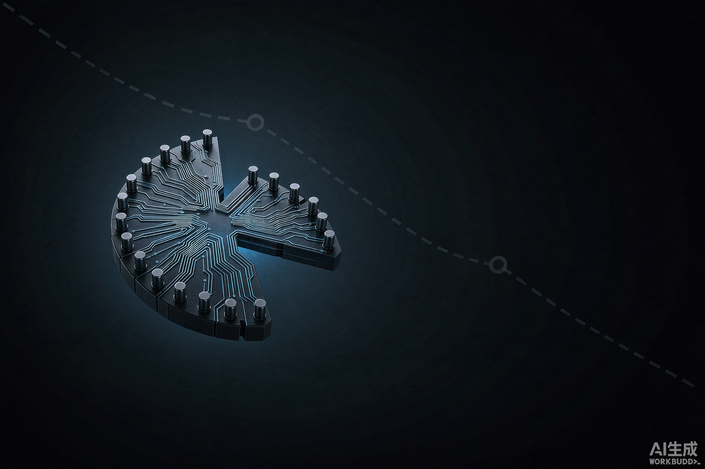

# 南芯科技：营收还在增长，利润为什么先掉进坑里？

> **先说结论：观望，已有研究仓位可以等待三季报验证，不建议仅因股价从高位跌了三成就急着抄底。**
>
> 南芯科技是一家有真实产品、真实客户和细分龙头地位的模拟芯片公司，长期逻辑比一般概念股扎实。但它现在正处在最难定价的阶段：老业务仍高度依赖手机，毛利率连续下降；汽车、工业和AI算力投入很大，收入贡献暂时还小。2026年上半年收入增长5.19%，利润却由盈转亏，说明新业务还没有覆盖研发和市场投入。
>
> 以2026年8月26日收盘价34.24元计算，公司约147亿元市值。按本报告的中性假设，2027年8月合理区间约31—38元，现价基本落在区间内，没有明显安全边际。真正值得重新提高评级的信号，不是新品发布数量，而是毛利率止跌、非消费电子收入占比提升，以及经营现金流转正。

## 这家公司到底靠什么赚钱：它不只做“快充芯片”

南芯科技的本质是一家 **Fabless模拟与嵌入式芯片设计公司**。Fabless的意思是公司负责定义产品、设计芯片、服务客户，但晶圆制造和封装测试交给外部供应商。

在一部手机、汽车或者服务器里，处理器负责“算”，南芯科技的芯片更多负责“把电安全、稳定、高效地送过去”。它的产品包括充电管理、电池保护、电量计量、DC-DC转换、显示电源、车载电源、驱动芯片、电流传感器、MCU，以及面向CPU/GPU供电的多相控制器和DrMOS等。

这条产业链可以这样理解：

| 环节 | 主要参与者 | 南芯科技的位置 |
| --- | --- | --- |
| 上游工具与制造 | EDA/IP、晶圆代工、封装测试 | 依赖外部产能，同时参与BCD特色工艺和器件开发 |
| 芯片设计 | 电源管理、信号链、驱动和传感芯片公司 | 南芯科技的核心位置，负责产品定义、设计和客户适配 |
| 下游渠道 | 经销商、模组厂、Tier 1 | 2025年经销收入占比约78%，直销约22% |
| 终端客户 | 手机、汽车、工业设备、服务器厂商 | 已进入小米、OPPO、vivo、荣耀、三星等手机品牌，并拓展安波福等汽车客户 |

公司的强项是手机电源管理。它已经形成从适配器AC输入、充电管理到手机内部电池供电的完整产品链，在主流安卓品牌旗舰和畅销机型中具有较强份额。这个位置有价值，因为电源芯片虽然单价不如主处理器高，却直接关系续航、安全、快充速度和整机稳定性，客户认证后不会轻易更换。

但产业链位置也决定了它目前的两项弱点。

第一，公司没有自己的晶圆厂。2026年上半年，8英寸晶圆代工价格上涨约5%—15%，部分成熟制程也出现涨价，南芯科技很难立即把全部成本转嫁给需求偏弱的手机客户。报告期末，公司对中芯国际和粤芯半导体的产能保证金分别达到2.25亿元和2300万元，说明保障产能本身也要占用资金。[2026年半年报](https://money.finance.sina.com.cn/corp/view/vCB_AllBulletinDetail.php?id=12500203&stockid=688484)

第二，公司的“平台化”故事仍主要由消费电子养着。2025年，消费电子贡献89.26%的收入；汽车、工业和智能算力合计只占约10.65%。2026年上半年消费电子占比仍有87.10%。汽车和工业增长很快，但基数还小，暂时不能把南芯科技当成成熟的汽车芯片或AI算力芯片公司。

## 生意在扩张，利润却连续变薄

过去三年，南芯科技的收入增长很快，但利润率、现金流和股东回报持续走弱。

| 指标 | 2023 | 2024 | 2025 | 2026上半年 |
| --- | ---: | ---: | ---: | ---: |
| 营业收入 | 17.80亿元 | 25.67亿元 | 32.61亿元 | 15.46亿元 |
| 收入同比 | 36.87% | 44.19% | 27.01% | 5.19% |
| 归母净利润 | 2.61亿元 | 3.07亿元 | 2.39亿元 | -0.45亿元 |
| 综合毛利率 | 42.30% | 40.12% | 37.74% | 35.28% |
| 净利率 | 14.68% | 11.95% | 7.32% | -2.90% |
| 加权ROE（净资产收益率） | 8.77% | 8.01% | 5.92% | -1.08% |
| 经营现金流 | 2.08亿元 | 4.43亿元 | -0.77亿元 | -1.03亿元 |
| 研发占收入 | 16.43% | 17.01% | 19.85% | 24.24% |

数据来源为公司[2025年年度报告](https://static.cninfo.com.cn/finalpage/2026-04-30/1225265339.PDF)和[2026年半年度报告](https://money.finance.sina.com.cn/corp/view/vCB_AllBulletinDetail.php?id=12500203&stockid=688484)。

这张表说明了三个问题。

### 收入增长已经明显降速

2025年收入增长27%，2026年上半年只增长5.19%。其中第二季度收入约7.89亿元，与2025年第二季度几乎持平；归母净利润却从盈利5917万元变成亏损4813万元。利润恶化不只是第一季度的偶然波动，第二季度也没有出现经营杠杆修复。

### 研发投入具有长期价值，但短期确实在吞利润

2026年上半年研发费用3.75亿元，同比增长32.73%；研发人员达到885人，占员工总数68.5%。同期销售费用增长54.51%，管理费用增长18.72%。公司上半年创造的毛利润约5.46亿元，研发费用就消耗了接近七成，再加上销售和管理费用，出现亏损并不意外。

研发不是坏事。问题在于汽车芯片、工业传感和AI供电产品从设计、流片、认证到批量出货需要很长时间。如果这些产品两三年后形成收入，今天的费用是投资；如果客户导入慢于预期，今天的费用就只是利润和现金流的持续压力。

### 现金流比利润表更需要警惕

2026年上半年经营现金流为-1.03亿元，购建固定资产和无形资产支付3.53亿元，粗略自由现金流约-4.57亿元。存货从2025年末的9.65亿元增至11.02亿元，增长14.24%；应收账款增长19.39%，都快于5.19%的收入增速。

公司解释称，备货增加是为了应对后续业务增长和供应链紧张，这个解释有经营逻辑。但库存是否真能转化为收入，要靠后续报表验证。好的一面是，公司发行15.87亿元可转债后，期末货币资金达到27.77亿元；按现金、交易性金融资产和有息债务保守计算，仍有约13亿元净现金，短期不存在偿债危机。

## 汽车、工业和AI算力，是机会，也是估值最容易讲过头的地方

2025年，南芯科技汽车电子收入2.06亿元，同比增长140.55%；工业收入1.38亿元，同比增长129.90%；智能算力收入约326万元。三块业务都在增长，但不能把增长率和利润贡献混为一谈。

汽车芯片的认证周期长，优点是一旦进入供应链，生命周期通常也长。南芯科技已经从车载充电扩展到高低边开关、eFuse、全桥电机驱动、48V双向DC-DC和座舱/智驾供电，产品方向合理。工业与算力领域则布局电流传感器、大电流POL、多相控制器和DrMOS，瞄准服务器、储能、机器人和工业自动化。

但截至2026年上半年，公司自己也明确提示，新领域收入占比仍小，商业化需要时间。换句话说，产业方向成立，并不等于南芯科技已经兑现了对应利润。投资者真正要看的不是“又发布了几颗芯片”，而是：

1. 汽车、工业和算力收入占比能否从目前约13%升到20%以上；
2. 新业务毛利率能否高于消费电子，并抵消晶圆代工涨价；
3. 研发费用率能否从24%逐步降回20%附近；
4. 客户认证能否转化为连续批量订单，而非少量试产。

## 股价为什么这么弱

截至2026年8月26日收盘，南芯科技报34.24元，总市值约147亿元。过去1个月下跌4.09%，过去3个月下跌26.87%，过去1年下跌31.12%。同期沪深300ETF分别约为-1.04%、-6.44%和+5.11%。[历史行情](https://finance.yahoo.com/quote/688484.SS/history/)

| 标的 | 近1个月 | 近3个月 | 近1年 |
| --- | ---: | ---: | ---: |
| 南芯科技 | -4.09% | -26.87% | -31.12% |
| 圣邦股份 | +13.05% | -2.70% | +42.19% |
| 杰华特 | -10.17% | +21.20% | +241.66% |
| 芯朋微 | +30.71% | -4.00% | +37.01% |
| 艾为电子 | -0.64% | -29.48% | -43.19% |
| 沪深300ETF | -1.04% | -6.44% | +5.11% |

行情数据采用Yahoo Finance复权收盘价计算。可比公司历史行情：[圣邦股份](https://finance.yahoo.com/quote/300661.SZ/history/)、[杰华特](https://finance.yahoo.com/quote/688141.SS/history/)、[芯朋微](https://finance.yahoo.com/quote/688508.SS/history/)、[艾为电子](https://finance.yahoo.com/quote/688798.SS/history/)。

南芯科技的弱势不是整个模拟芯片板块同步下跌可以解释的。更主要的原因有五个。

第一，市场看到的是“收入微增、利润转亏”，不是简单的成长投入。毛利率已经从2023年的42.30%连续降至35.28%，尚未证明投入期即将结束。

第二，消费电子仍占87.10%。手机需求承压，而汽车、工业和算力暂时不足以决定公司总利润。

第三，2026年4月7日共有1.32亿股首发限售股解禁，占当时总股本30.98%，公司股份由此全部进入可流通状态。半年报显示，上海集成电路产业基金、安克创新、顺为资本旗下基金和全国社保基金组合在上半年均有不同程度减持。它不必然代表看空公司，但客观上增加了筹码供给。

第四，可转债形成了新的价格锚。南芯转债当前转股价为43.71元，股票长期低于转股价85%的37.15元，已经再次接近触发下修条件。公司8月初曾选择不下修，目前又发布了预计触发提示。这意味着现价不仅反映盈利压力，也反映转债下修与未来稀释的不确定性。[转债提示公告](https://money.finance.sina.com.cn/corp/view/vCB_AllBulletinDetail.php?id=12527890&stockid=688484)

第五，当前价格离52周低点32.10元不远，但“接近低点”不等于“估值便宜”。利润快速下降时，股价创新低和市盈率上升可以同时发生。

## 跟同行一比，南芯的问题更清楚了

下面采用2026年8月26日前后市值和2025年财务数据做横向比较。由于各公司业务结构不同，市盈率只作辅助，不能机械排名。

| 公司 | 主要特点 | 2025收入 | 收入增长 | 2025归母净利 | 毛利率 | ROE | 当前市值约 | 市销率约 |
| --- | --- | ---: | ---: | ---: | ---: | ---: | ---: | ---: |
| 南芯科技 | 手机电源管理领先，拓展汽车/工业/算力 | 32.61亿元 | 27.01% | 2.39亿元 | 37.74% | 5.92% | 147亿元 | 4.5倍 |
| 圣邦股份 | 平台型模拟龙头，信号链和电源管理更均衡 | 38.98亿元 | 16.46% | 5.47亿元 | 50.94% | 11.24% | 约779亿元 | 20.0倍 |
| 杰华特 | 虚拟IDM，电源管理品类广，仍在亏损 | 26.55亿元 | 58.15% | -7.17亿元 | 26.37% | 负值 | 约542亿元 | 20.4倍 |
| 芯朋微 | 家电/工业电源基础较强，向服务器和汽车扩展 | 11.43亿元 | 18.47% | 约1.85亿元 | 37.26% | 7.17% | 约117亿元 | 10.2倍 |
| 艾为电子 | 数模混合、电源管理、信号链，消费电子属性较强 | 28.54亿元 | -2.71% | 3.17亿元 | 35.43% | 7.81% | 约126亿元 | 4.4倍 |

同业财务来源：[圣邦股份2025年度财务决算](https://vip.stock.finance.sina.com.cn/corp/view/vCB_AllBulletinDetail.php?id=12032805)、[杰华特年报问询回复](https://money.finance.sina.com.cn/corp/view/vCB_AllBulletinDetail.php?id=12390145&stockid=688141)、[芯朋微2025年报](https://stock.stockstar.com/notice/SN2026031300040912.shtml)、[艾为电子2025年报](https://money.finance.sina.com.cn/corp/view/vCB_AllBulletinDetail.php?id=12073947&stockid=688798)。

这张表不能得出“南芯科技市销率最低，所以最便宜”的结论。圣邦股份拥有更高毛利率和ROE，理应享受明显溢价；杰华特则包含很强的国产替代和产品放量预期，当前估值具有明显主题属性，不适合作为稳健估值锚。南芯科技最接近的估值参照是艾为电子，二者市销率相近，但艾为电子2025年净利率和现金盈利表现更好。

南芯科技当前静态市盈率约62倍，滚动市盈率约207倍。滚动市盈率异常高，是因为最近四个季度合计净利润只剩约7107万元。真正的问题不是市销率，而是市场愿意等多久，等它把收入重新转化为利润。

## 现在的价格，已经包含了什么预期

截至8月24日，近六个月只有一家机构在半年报后更新预测，因此不能把它当成可靠的一致预期。该预测给出2026年收入35.70亿元、归母净利润2.04亿元，2027年收入44.27亿元、净利润3.12亿元。[机构预测汇总](https://basic.10jqka.com.cn/688484/worth.html)

这个预测并不保守。要实现2026年净利润2.04亿元，公司下半年需要盈利约2.49亿元，是2025年下半年1.16亿元的两倍以上；与此同时，下半年收入只需同比增长约13%。也就是说，市场等待的是研发和销售费用率迅速下降、毛利率止跌带来的强经营杠杆。

用当前约147亿元市值反推：

- 如果市场愿意给2027年50倍市盈率，公司需要实现约2.94亿元净利润；
- 如果只给40倍市盈率，则需要约3.68亿元净利润；
- 单一机构的2027年3.12亿元预测，对应当前约47倍市盈率。

这说明现价并没有按“长期亏损”定价，而是在押注2027年利润明显恢复。

## 三种情景：当前更接近中性价值

以下是本报告基于历史经营、半年报、产品结构和同行估值建立的买方情景，不是公司指引，也不是收益承诺。目标日期为2027年8月26日。

| 情景 | 2026收入/净利 | 2027收入/净利 | 关键假设 | 合理价值区间 |
| --- | --- | --- | --- | ---: |
| 悲观 | 33亿元/0.5亿元 | 36亿元/1.2亿元 | 消费电子继续承压，新业务放量慢，毛利率低位徘徊，研发费用率仍高 | 约20—24元 |
| 中性 | 35.5亿元/1.6亿元 | 43亿元/3.0亿元 | 手机业务稳定，非消费收入占比提升，毛利率逐步修复，研发投入出现经营杠杆 | 约31—38元 |
| 乐观 | 37.5亿元/2.4亿元 | 49亿元/4.5亿元 | 汽车、工业和算力产品同时放量，高毛利产品改善结构，费用率明显下降 | 约50—53元 |

主要方法采用2027年市盈率，分别给予30倍、45倍和55倍；独立校验采用EV/Sales，也就是“企业价值除以营业收入”，并保守计入约13亿元净现金。两种方法在中性和乐观情景下相互接近，悲观情景差异很大，恰好揭示了最大风险：如果研发投入无法转化为利润，按收入看起来不贵，按利润仍可能非常贵。

详细假设保存在[估值模型](/valuation-assumptions.json)中，可复算结果如下：中性情景PE法约31.11元，EV/Sales法约37.75元；乐观情景约50.29—53.23元。现价34.24元位于中性区间中部。

## 现在该怎么做

### 对准备新建仓的人

当前不适合把“跌了很多”当成买入理由。34.24元距离本报告中性估值中心不远，向上的空间依赖利润拐点，向下则仍可能测试32.10元附近的52周低点。

更有利的两种选择是：

- **价格等待**：在基本面没有进一步恶化的情况下，25—28元才开始提供较明显的中性估值安全边际；
- **业绩等待**：即使股价没有更低，也可以等三季报确认毛利率不再下降、收入重新达到两位数增长、单季亏损明显收窄，再接受更高价格。

### 对已经持有的人

研究上可以继续持有观察，但理由不能只是“公司是国产替代”。持有逻辑必须建立在三个条件上：

1. 2026年全年收入不低于约33亿元；
2. 下半年综合毛利率不继续跌破34%；
3. 汽车、工业和算力收入占比继续提升，经营现金流开始改善。

如果三项同时失效，应该把公司从“投入期成长股”下调为“增长放缓、利润不确定的高估值公司”。若股价有效跌破32.10元，同时三季报仍显示利润和现金流恶化，不适合仅凭技术位置补仓。

### 对短线交易者

当前上方除了39.99元IPO发行价，还有43.71元可转债转股价形成心理与筹码参照。股价若没有业绩催化，反弹到这些区域可能遇到较强分歧。下方32.10元是过去一年已验证的低点，但技术位只能用于风控，不能代替利润拐点。

## 我最可能错在哪里

支持南芯科技的最强证据，是它在手机电源管理领域确有客户和份额，汽车、工业和算力产品也不是纯概念，公司还有充足资金支持研发。若新业务批量导入速度超过预期，研发费用率快速下降，利润弹性会很大。

反对它的最强证据，则是毛利率已经连续三年下降，2026年第二季度收入几乎不增长却出现亏损；存货、应收和资本开支同时上升，说明利润拐点尚未发生。当前价格又已经隐含2027年约3亿元利润和接近50倍市盈率，赔率并不便宜。

后续最值得跟踪的五项数据是：

1. 每季度综合毛利率，先看能否守住34%—35%；
2. 汽车、工业和智能算力收入占比，目标是逐步突破15%和20%；
3. 研发费用率，能否从24.24%回落到20%左右；
4. 存货、应收账款和经营现金流是否同步改善；
5. 南芯转债是否下修转股价，以及潜在转股对股本的摊薄程度。

**最后一句话：南芯科技是值得长期跟踪的公司，但34.24元还不是让人忽略风险的价格。现在买的是2027年的利润修复，不是2026年已经兑现的业绩。**

市场有风险，以上为研究和决策参考，不构成收益承诺；具体操作需结合资金期限、风险承受能力和最新信息独立判断。

## 数据口径

- 行情截止：2026年8月26日收盘；阶段收益使用复权收盘价计算。
- 财务截止：2026年半年度报告，未经审计。
- 股本口径：2026年8月3日完成限制性股票归属后的429,610,678股；情景估值另考虑股权激励与乐观情景下的可转债潜在稀释。
- 市值、估值和情景价值均由本报告按上述口径重新计算，可能与不同数据终端显示值因股本、TTM和预测口径不同而存在差异。
