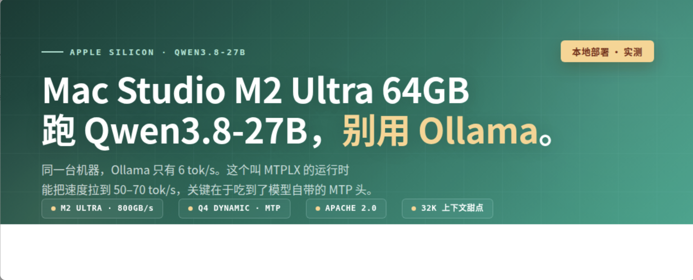

# Mac Studio M2 Ultra 64GB 部署 Qwen3.8-27B 深度方案

> 面向：Mac Studio M2 Ultra / 64GB 统一内存 / 800GB/s 内存带宽
> 目标模型：Qwen3.8-27B（Apache 2.0，2026-08 发布）
> 研究日期：2026-08-29

---

## 一、结论先行：装 MTPLX，跑 FP16 构建版，turbo 档

三句话说清楚：

1. **你的机器是跑 Qwen3.8-27B 的好平台，但不是"最强"那一档**。64GB 统一内存 + 800GB/s 带宽，Q4 量化后模型占约 21GB，剩 40GB 给 KV cache 和系统——32K 上下文是甜点，64K 要掂量，128K 满窗会爆。
2. **选 MTPLX 而不是 Ollama**。同一个模型、同一台机器，社区实测 Ollama 只有 6.11 tok/s，MTPLX 在 turbo 档能到 18–21 tok/s——**约 3 倍差距**。根因是 Qwen3.8 原生自带 MTP 加速头，而 Ollama/llama.cpp 在 Metal 后端几乎没吃到这个红利。
3. **你大概率能跑到 40–70 tok/s**（推算值，见第二节），这个速度已经可以当主力编码/Agent 用，不用再惦记云端。

一句话推荐配置：

```bash
brew install youssofal/mtplx/mtplx
mtplx pull Youssofal/Qwen3.8-27B-MTPLX-Optimized-Speed-FP16
mtplx serve --model Youssofal/Qwen3.8-27B-MTPLX-Optimized-Speed-FP16 \
            --context-window 32768 --profile turbo --no-auth
```

然后任何 OpenAI / Anthropic 兼容客户端指向 `http://127.0.0.1:8000/v1` 即可。

---

## 二、先算清楚你的机器能吃多少、跑多快

### 2.1 内存账：64GB 不是 64GB

Apple Silicon 统一内存，GPU 能 wire 住的上限由内核动态推导，通常是**已安装内存的 75%–78%**。64GB 机器上：

| 项目 | 数值 | 说明 |
|---|---|---|
| 已安装内存 | 64 GiB (65,536 MiB) | `sysctl hw.memsize` |
| Metal 默认可用上限 | **约 48–50 GiB** | `recommendedMaxWorkingSetSize`，需实测 |
| 系统保留（reserve） | 约 15–17 GiB | 内核、窗口服务器、内存压缩器 |

**操作方法**（在改任何东西之前，先读你自己的数字）：

```bash
sysctl iogpu.wired_limit_mb hw.memsize
```

```swift
// ceiling.swift —— swift ceiling.swift
import Metal
let d = MTLCreateSystemDefaultDevice()!
print(d.name, d.recommendedMaxWorkingSetSize)
```

### 2.2 模型账：Qwen3.8-27B 各量化档位

BF16 原始权重 **54.7GB**——64GB 机器上直接跑原生精度不现实（装得下但没空间给 KV cache）。所以必须量化：

| 量化档 | GGUF 大小 | KLD ↓ | 与 BF16 Top-1 一致率 ↑ | 64GB 机器评价 |
|---|---|---|---|---|
| Q8_0 | 29.0 GB | 0.00064 | 98.92% | 能跑，但上下文只剩 ~15GB |
| Q6_K | 22.9 GB | 0.00107 | 98.67% | 质量/空间平衡好，**可考虑** |
| Q5_K_M | 19.8 GB | 0.00419 | 97.34% | 甜点偏质量 |
| **UD-Q4_K_XL** | **17.9 GB** | 0.00955 | ~95.6% | **推荐起点** |
| Q4_K_M | 17.1 GB | 0.01126 | 95.59% | 通用保险选项 |
| UD-Q3_K_XL | 13.4 GB | 0.03247 | 92.41% | 不推荐，误差开始陡增 |

数据来源：Unsloth / AtomicChat 对 Qwen3.8-27B 的统一 held-out 测试。

**关键判断：Q4 是拐点。** 从 Q8 降到 Q4，模型输出分布仍相对接近 BF16；从 Q4 继续压到 Q3/Q2，误差上升明显加速。对 Coding / Agent 场景，只要硬件允许就该上 Q5/Q6，而不是无脑默认 Q4。

### 2.3 速度：用带宽公式算，别信别人的数字

大模型 decode 是**内存带宽受限**：每生成一个 token，要把整套权重从内存搬一遍。所以：

```
理论速度 ≈ 内存带宽 / 每次生成的权重搬运量
```

你的 M2 Ultra 是 **800GB/s**（Apple 官方规格，M2 Max 的两倍）。已知锚点：

| 机器 | 带宽 | 模型 | 实测速度 |
|---|---|---|---|
| M2 Max 32GB | 400 GB/s | Qwen3.8-27B Q4 MLX | **28.3 tok/s** |
| M 系列 64GB（老机器） | — | 同模型，MTPLX turbo 档 | 18.6–21.0 tok/s |
| M5 Max | — | 同模型，MTPLX 官方 | 58.7 tok/s |

**推算你的 M2 Ultra**：带宽是 M2 Max 的 2 倍，但 M2 Ultra 是 2023 年架构，MLX kernel 对老芯片的优化程度不如 M4/M5 世代。

- 无 MTP 基线：**约 35–45 tok/s**
- 开 MTPLX（1.6×–2.24×）：**保守 50–70 tok/s**

⚠️ 这是推算，不是实测。**装完第一件事就是跑 `mtplx tune --retune`**，它会拿真实模型在你机器上把每个 draft depth 都跑一遍，只保留真的比基线快的档位。

---

## 三、Qwen3.8-27B 到底是什么

顺带澄清一下型号：Qwen3.8 是阿里 2026 年 8 月发布的新系列（Qwen3.8-Flash 是 125B-A6B 的 MoE，Qwen3.8-27B 是里面紧凑的 dense 型号）。不是 Qwen3（2025）也不是 Qwen3.5（2026-02）。

| 属性 | 值 |
|---|---|
| 参数 | 27B，**Dense**（非 MoE，每个 token 全量激活） |
| 许可证 | **Apache 2.0**，可商用 |
| 上下文 | 原生 262,144 tokens（256K），YaRN 可扩展到 1M |
| 模态 | 文本 + 图片 + 视频 → 文本 |
| 思考模式 | 默认开启，`reasoning_effort` 可调（xhigh / medium / low） |
| MTP 头 | **原生训练**，GGUF 里 `blk.*.nextn.*` 张量保留 |
| 评测 | Terminal Bench 2.1 = 73.0；SWE-bench Pro = 61.7；SWE-bench Verified 区间顶尖 |

**Dense 这一点很重要**：它不像 Qwen3.5-35B-A3B / Qwen3.6-35B-A3B 那种 MoE（总参 35B 但只激活 3B）。Dense 意味着每生成一个 token 都要搬完整的 27B 权重，**速度上限被带宽锁死**，但也意味着质量密度更高——同样 27B，Dense 比同尺寸 MoE 聪明。

---

## 四、七条部署路线横评

| 方案 | 后端 | M2 Ultra 适配 | 吃 MTP | 速度预期 | API | 推荐度 |
|---|---|---|---|---|---|---|
| **MTPLX** | MLX | ✅ 需 `-FP16` 构建 | ✅ **原生** | 最高 | OpenAI + Anthropic 双兼容 | ★★★★★ 主力 |
| **oMLX** | MLX | ✅ | ⚠️ 部分 | 高 | OpenAI 兼容 | ★★★★ 服务化 |
| **LM Studio** | MLX/GGUF | ✅ | ❌ | 高 | OpenAI 兼容 | ★★★★ 上手/GUI |
| **mlx-lm** | MLX | ✅ | ❌ 需手动 | 高 | 需自建 | ★★★ 二次开发 |
| **llama.cpp** | Metal GGUF | ✅ | ❌ **Metal 几乎无收益** | 中 | OpenAI 兼容 | ★★★ 精细控制 |
| **Ollama** | GGUF/MLX | ✅ | ❌ 支持有限 | **低（6.11 tok/s）** | OpenAI 兼容 | ★★ 生态兜底 |
| **vLLM / SGLang** | 多后端 | ⚠️ Mac 支持弱 | ✅ | 中 | OpenAI 兼容 | ★ 不推荐 |

### 4.1 MTPLX —— 首选

**为什么**：Qwen3.8 训练时就带了 MTP（Multi-Token Prediction）头，可以一次草拟多个 token、主模型批量校验、精确拒绝采样。这个红利在 Mac 上几乎是白送的——但**只有 MTPLX 真的吃到了**。

关键事实：
- MTPLX 是 Apple Silicon 上第一个用模型自带 MTP 头做数学精确投机采样的运行时（2026-04-27，早于 llama.cpp 支持 MTP）
- 采用 **NAX verify kernels + 编译 verify**，这是它在 Metal 上比 llama.cpp 快的核心原因
- 实测加速：M4 Mac mini 16GB **1.6×**，M5 Max **2.24×**
- 精确拒绝采样（Leviathan & Chen 定理 + residual correction），`temperature=0.6, top_p=0.95` 下行为与普通解码完全一致——**不是贪心近似，不会改变输出分布**

**M2 Ultra 必踩的坑：必须用 `-FP16` 构建版**

不带 `-FP16` 的 Optimized-Speed 是 **bf16 计算版**，M1/M2 的 GPU 没有 bf16 指令，跑不了。官方说会自动切换，**但实测拉取和起服务时模型名必须显式带 `-FP16`**，写不带后缀的名字会直接报 `model is not available locally`。

> 权重仍然是 4-bit 量化，FP16 只是计算精度，不用担心内存翻倍——实测服务基线 23.6GB。

**三个构建版本怎么选**：

| 版本 | 特点 | 适合 |
|---|---|---|
| Bare Speed | 爆发式对话最快 | 快速聊天 |
| **Optimized Speed** | 4-bit 动态量化，编码速度好、质量好 | **编码/Agent 主力** |
| Optimized Quality | 8-bit 动态量化，质量完美 | 追求质量、内存有余 |

### 4.2 为什么 llama.cpp 不是最优解

llama.cpp 从 PR #22673（2026-07）起原生支持 `--spec-type draft-mtp`，在 NVIDIA 卡上能拿到 +33% 到 +145%。**但在 Apple Silicon 上几乎无效**：

| 平台 | 基线 | 开 MTP | 提升 |
|---|---|---|---|
| RTX 5090 32GB (UD-Q4_K_XL, 131K) | 74.4 | 182.0 | **+145%** |
| RTX 4090 24GB | 47.7 | 76.3 | +60% |
| Apple M4 24GB (Metal) | 5.8 | 5.8 | **≈0%** |
| Mac Studio **M3 Ultra** (Q6_K, 131K) | 22.8 | 24.2 | **+6%** |

原因：Metal 后端 batch-8 decode 摊薄只有 1.2×，而 CUDA 能到 3.3×。M3 Ultra 都只有 +6%，M2 Ultra 不会有惊喜。

**结论**：llama.cpp 适合你要精细控制 KV 量化、GGUF 生态、或者跑奇怪模型的场景，但作为 Qwen3.8-27B 的主力运行时，它比 MTPLX 慢一大截。

### 4.3 Ollama 为什么只有 6.11 tok/s

社区实测同一台机器，`qwen3.8:27b-mtp` 在 Ollama 上只有 **6.11 tok/s**。原因是对 Qwen3.8 的 MTP 头支持有限。Ollama 的价值在于生态兼容性（`ollama run` 一行搞定、模型库丰富、客户端支持多），**但不适合当 27B 的主力推理引擎**。

### 4.4 oMLX —— 如果你要服务化 / 多并发

定位不同：oMLX 是 **LLM inference server**，核心是**连续批处理 + 分层 KV 缓存**（热层放内存、冷层放 SSD，跨请求跨重启不丢缓存）。还有针对 Qwen 系列的自定义 Metal kernel。

适合场景：
- 长时间编码会话（Claude Code / Cline 这类 Agent 反复喂长上下文）
- 多人/多客户端共享
- 需要 Web 仪表盘 + 菜单栏管理

单流峰值速度不如 MTPLX，但**长会话和多并发体验更好**。

### 4.5 LM Studio —— 如果你要 GUI 和快速上手

MLX 引擎，GUI 选模型/调参数，OpenAI 兼容 API。速度在 MLX 阵营里属于正常水平。适合先跑通、试不同模型、做视觉多模态调试。

---

## 五、落地步骤（照抄即可）

### Step 0：体检

```bash
# 1. 确认芯片与内存
sysctl -n machdep.cpu.brand_string hw.memsize

# 2. 确认 Metal 可用上限（写个 ceiling.swift 跑一次，见 2.1）

# 3. 确认磁盘剩余（模型 21.3GB，建议留 40GB+）
df -h ~

# 4. 确认 macOS 版本（MTPLX 要求 14+）
sw_vers
```

### Step 1：装 MTPLX

```bash
brew install youssofal/mtplx/mtplx
# 或者：python3 -m pip install mtplx
# 或者：去 mtplx.com 下 DMG（Mac App 会自动检测硬件、推荐模型、装风扇控制）
```

### Step 2：拉模型（**名字必须带 `-FP16`**）

```bash
# 先体检兼容性，别白等
mtplx inspect Youssofal/Qwen3.8-27B-MTPLX-Optimized-Speed-FP16
# 期望输出：tier: verified / can_run: true / mtp_tensors_present: 15

# 下载（MLX 4-bit，21.3GB）
mtplx pull Youssofal/Qwen3.8-27B-MTPLX-Optimized-Speed-FP16
```

### Step 3：起服务

```bash
mtplx serve --model Youssofal/Qwen3.8-27B-MTPLX-Optimized-Speed-FP16 \
            --context-window 32768 \
            --profile turbo \
            --no-auth
```

监听 `http://127.0.0.1:8000`，OpenAI + Anthropic 双兼容。

### Step 4：测速并自动调优

```bash
# 用真实模型在你的机器上把每个 draft depth 跑一遍，只保留真比基线快的
mtplx tune --model Youssofal/Qwen3.8-27B-MTPLX-Optimized-Speed-FP16 --retune
```

输出示例（M4 mini 9B）：baseline 14.4 tok/s → D1 23.0 tok/s。

### Step 5：接入客户端

| 客户端 | 配置 |
|---|---|
| Claude Code / Cline / Continue / OpenCode | API Base = `http://127.0.0.1:8000`，Key 随意填 |
| Cherry Studio / Open WebUI | 添加 OpenAI 兼容服务，地址 `http://127.0.0.1:8000/v1` |
| Python | `openai.OpenAI(base_url="http://127.0.0.1:8000/v1", api_key="local")` |

验证：

```bash
curl http://127.0.0.1:8000/v1/models
curl http://127.0.0.1:8000/v1/chat/completions \
  -H 'Content-Type: application/json' \
  -d '{"model":"mtplx","messages":[{"role":"user","content":"用 Python 写个快排"}],"stream":true}'
```

---

## 六、四个决定体验的调优项（别跳过）

### 6.1 reasoning_effort —— 最容易被忽略的性能杀手

Qwen3.8 默认开启 thinking，且默认 `reasoning_effort` 是 **xhigh**。这意味着一个简单问题也可能先"想"两万 token。**很多人以为本地模型慢是硬件不行，其实是模型想太多。**

建议分场景设：

| 场景 | reasoning_effort |
|---|---|
| 日常聊天、简单问答 | 关闭 thinking 或 `low` |
| 一般 Coding / Agent | `medium` |
| 复杂调试、架构分析、数学 | `xhigh` |

### 6.2 profile 必须用 turbo，别用 sustained

实测同一台机器、同一窗口：

| 窗口 | turbo | sustained |
|---|---|---|
| 32K | 18.6 | 12.4 |
| 64K | **19.3** | **6.1** |
| 128K | 21.0 | 7.0 |
| 256K | 15.1 | 6.9 |

网上流传的"超过 32K 速度断崖"，实测就是误用 sustained 档 + 机器热降频造成的假象。

### 6.3 上下文窗口：设大不等于占内存

MTPLX 按请求分配 KV，`--context-window 128K` 只是告诉模型"最多能吃 128K"，你实际只喂几 K 时内存就是 ~25GB 的舒适区。

但**灌满就要算账了**（实测每 1K token 增约 0.35–0.55GB）：

| 实际上下文 | 预估内存 | 64GB 机器 |
|---|---|---|
| 服务基线 | 23.6 GB | 舒适 |
| 32K 满窗 | ~37 GB | ✅ 还能开浏览器 |
| 64K 满窗 | ~55 GB | ⚠️ 顶到天花板 |
| 128K / 256K 满窗 | 爆 | ❌ 别试 |

**推荐 32768 起步，写作/长文档场景换 65536。**

内存不够时的解法（有代价）：

| KV 量化 | 省内存 | 速度代价 |
|---|---|---|
| `--paged-kv-quantization q8` | ~4.7 GB | **-30%** |
| `--paged-kv-quantization q4` | 更多 | **-41%** |

### 6.4 散热：M2 Ultra 会降频

连续高负载后，实测同配置速度能掉一半多（64K turbo：19.3 → 10.5）。M2 Ultra 是 Mac Studio 主机，散热比笔记本好得多，但长时间跑 Agent 仍建议：

```bash
mtplx max --install   # 风扇控制，一次 sudo，crash-safe
```

监控指标：
- **活动监视器 → 内存 → Swap Used**：理想恒为 0。一旦出现 swap，速度断崖
- `powermetrics --samplers gpu_power`：看 GPU 利用率

### 6.5 （可选，最后手段）提高 Metal 内存上限

```bash
sudo sysctl iogpu.wired_limit_mb=51712   # 示例：实测值 + 1GB
```

⚠️ **这是排第四的选择，前三个零风险且质量代价小**：
1. 降一档量化（Q6→Q5 省约 3GB）
2. 缩短上下文
3. 量化 KV 缓存（q8/q4）
4. 最后才是动 sysctl

风险要知道：wired 内存是 macOS 唯一不能 page out / 压缩 / 回收的内存状态。超量不会弹错误对话框，而是**内核级冻结、光标无响应、丢未保存工作**。

规则：
- 首步 = 实测 `recommendedMaxWorkingSetSize`(MB) + 1024
- 上限 ≈ 实测值 + reserve/2（64GB 机器约 57,000–58,500 MB）
- 给系统至少留 4 GiB
- **顺序：先 sysctl，再启动 App**（进程启动时读一次并缓存）
- 用完 `sudo sysctl iogpu.wired_limit_mb=0` 恢复，重启也会自动归零

它**不会让推理变快**，只决定能不能装下。

---

## 七、方案选择决策树

```
你的主要用途是什么？
│
├─ 编码 / Agent 主力，追求单流速度
│   └─ MTPLX + Optimized-Speed-FP16 + turbo + 32K    ★ 首选
│
├─ 长时间编码会话、多客户端共享、要 Web 仪表盘
│   └─ oMLX（连续批处理 + 分层 KV）
│
├─ 想先跑通看看、要 GUI、要试视觉多模态
│   └─ LM Studio（MLX 引擎）
│
├─ 要精细控制（KV 量化、GGUF 生态、自定义采样）
│   └─ llama.cpp（但 Metal 上 MTP 收益 ≈ 0，别指望加速）
│
├─ 已有 Ollama 生态、客户端绑定深
│   └─ Ollama 保留，但 6.11 tok/s 只能当兜底
│
└─ 要嵌进自己的 Python 服务 / 做脚本化批处理
    └─ mlx-lm（mlx_lm.server）
```

---

## 八、坑与风险清单

| 坑 | 表现 | 解法 |
|---|---|---|
| 模型名漏 `-FP16` | `model is not available locally` | M1/M2 必带 `-FP16` 后缀 |
| 用了 `sustained` 档 | 速度掉到 6–7 tok/s | 改 `--profile turbo` |
| 机器热降频 | 同配置速度掉一半多 | `mtplx max --install`，注意通风 |
| 128K/256K 上下文灌满 | 内存爆 | 32K 起步，64K 是天花板 |
| reasoning 默认 xhigh | 简单问题等两分钟 | 按场景调 `reasoning_effort` |
| Ollama 模型直接喂 MTPLX | 不兼容 | youssofal 这套是 MTPLX 专用（`mtp.safetensors` + `mtplx_runtime.json`） |
| 磁盘不够 | 下载失败 | 模型 21.3GB，留 40GB+ |
| 出现 Swap Used > 0 | 速度断崖 | 降量化 / 减上下文 / 量化 KV |

---

## 九、如果 27B 不够，还有什么选择

基于你的 64GB，几个值得考虑的替代或补充：

| 模型 | 类型 | Q4 占用 | Mac 上特点 |
|---|---|---|---|
| Qwen3.8-27B | Dense 27B | ~21 GB | 质量密度最高，速度被带宽锁死 |
| Qwen3.6-35B-A3B | MoE 35B/3B激活 | ~23 GB | **激活参数只有 3B，速度快得多**（M3 Ultra 实测 80 tok/s 量级） |
| Qwen3.5-35B-A3B | MoE 35B/3B激活 | ~23 GB | 官方称超越 Qwen3-235B-A22B |
| Qwen3.8-Flash-Next | MoE 125B/6B激活 | 太大 | 64GB 装不下，跳过 |

**如果你的场景是"快"高于"聪明"**，Qwen3.6-35B-A3B 或 Qwen3.5-35B-A3B 这类 MoE 值得一试：MoE 在 decode 时每个 token 只搬运被激活的专家权重，带宽压力小得多，速度可能是 Dense 27B 的 2–3 倍。缺点是需要把全部 35B 权重放内存（约 23GB，你够），且质量密度不如同代 Dense 27B。

**建议**：先按 Qwen3.8-27B 装 MTPLX 跑通，然后用同一个运行时拉一个 MoE 版本做 A/B，用你自己的真实任务（网格商机那套 Agent、或者日常编码）来判，别看榜单。

---

## 十、数据来源

| 内容 | 来源 |
|---|---|
| Qwen3.8-27B 量化档位与 KLD 数据 | [DataLearner 部署指南](https://www.datalearner.com/blog/qwen3-8-27b-local-deployment-quantization-guide) |
| llama.cpp MTP 在 Metal 上无收益（M3 Ultra +6%、M4 ≈0%） | [qwen38-mtp 社区实测合集](https://github.com/sudoingX/qwen38-mtp) |
| MTPLX 架构、加速倍数、FP16 构建要求 | [MTPLX GitHub](https://github.com/youssofal/mtplx) |
| MTPLX 老机器四档上下文实测（turbo vs sustained、内存曲线） | [社区实测报告](https://baijiahao.baidu.com/s?id=1873946965667771244) |
| M2 Max 28.3 tok/s 实测锚点 | [统一内存档位速度公式](https://post.smzdm.com/p/a70dxnvo) |
| M2 Ultra 800GB/s 带宽、60/76 核 GPU | [Apple 官方新闻稿](https://www.apple.com.cn/newsroom/2023/06/apple-introduces-m2-ultra/) |
| iogpu.wired_limit_mb 规则与风险 | [ModelPiper 深度解析](https://modelpiper.com/blog/iogpu-wired-limit-mb-mac) |
| Qwen3.8-27B 官方规格与评测 | [HuggingFace Qwen/Qwen3.8-27B](https://huggingface.co/Qwen/Qwen3.8-27B) |
| Qwen3.6 在 Mac Studio 上的机型/量化对照 | [Mac Studio Qwen3.6 指南](https://dranixj.com/articles/mac-studio-qwen-3-6-local-llm-guide) |

---

## 附：一页速查卡

```bash
# 装
brew install youssofal/mtplx/mtplx

# 检
mtplx inspect Youssofal/Qwen3.8-27B-MTPLX-Optimized-Speed-FP16

# 拉（21.3GB）
mtplx pull Youssofal/Qwen3.8-27B-MTPLX-Optimized-Speed-FP16

# 跑（32K 甜点）
mtplx serve --model Youssofal/Qwen3.8-27B-MTPLX-Optimized-Speed-FP16 \
            --context-window 32768 --profile turbo --no-auth

# 调
mtplx tune --model Youssofal/Qwen3.8-27B-MTPLX-Optimized-Speed-FP16 --retune

# 停
mtplx stop
```
