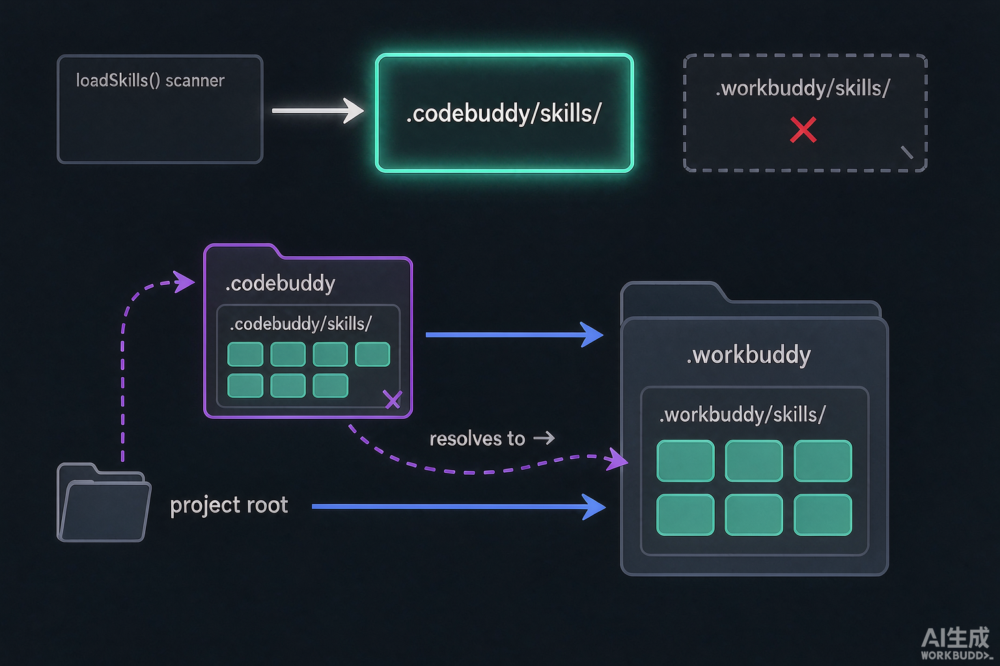

事情起因很具体：我要把一篇写好的文章发到公众号草稿箱，于是让 WorkBuddy 调用 `wechat-site-publisher` 这个 Skill。

它自己不干脏活。真正的发布动作由 `baoyu-post-to-wechat`、配图由 `baoyu-cover-image` 这些外部开源 Skill 完成，`wechat-site-publisher` 只负责编排和包装。

这些依赖我早就装好了，就放在项目根目录的 `.workbuddy/skills/` 下，37 个，一个不少。文档里也是这么写的——项目级 Skill 放在 `.workbuddy/skills`，天经地义。

然后 WorkBuddy 告诉我：这些 Skill 不在可用列表里。

我列了一下当前会话能用的 Skill，22 个。而机器上总共摆着 63 个，分散在三处。**项目里的 53 个，一个都不在那 22 个里面。**

不是 Skill 写得有问题——它们安安静静躺在磁盘上，文件齐全，frontmatter 规范。只是从来没被扫到过。

这篇文章记录我从内核源码里挖出来的答案，以及为什么「项目级 `.workbuddy/skills`」这个看起来天经地义的路径，在实现里根本不存在。

## 先说一个错误的排查方向

我的第一反应是：**索引器不跟随符号链接**。

这个猜测听起来合理，因为项目里的 Skill 大多是软链，指向外部的技能仓库。但它错得很彻底，两条证据：

第一，用户级目录 `~/.workbuddy/skills/` 下 10 个 Skill 里有 6 个是软链，全部正常加载。软链要是不被跟随，它们也该失效。

第二，源码里的目录判定写得明明白白：

```js
async isDirectoryEntry(path, entry) {
  if (entry.isDirectory()) return true
  if (!entry.isSymbolicLink()) return false
  try { return (await stat(path)).isDirectory() } catch { return false }
}
```

注意用的是 `stat`，不是 `lstat`。`lstat` 读链接本身，`stat` 读链接指向的目标。用 `stat` 意味着**跟随软链是明确的设计**，不是碰巧能用。

教训是：先验证再动手。这个错误假设如果顺着走下去，会去改软链为实体拷贝，制造出两份永远会漂移的副本，而真正的问题一个都没解决。

## 源码里的答案

WorkBuddy 的内核是一份打包过的 JS，路径在 `/Applications/WorkBuddy.app/Contents/Resources/app.asar.unpacked/cli/dist/codebuddy.js`。变量被压缩过，但逻辑完整。

加载 Skill 的入口函数长这样（格式化后）：

```js
async loadSkills() {
  const all = [], skip = new Set(), seen = new Set()
  const addSkills = (list) => {
    for (const s of list) {
      if (!seen.has(s.name)) { seen.add(s.name); all.push(s) }
    }
  }

  const projectDir = PathUtils.getProjectSkillsDir()
  if (await this.pathExists(projectDir))
    addSkills(await this.scanSkillsDirectory(projectDir, "project", skip))

  const homeDir = PathUtils.getHomeSkillsDir()
  if (await this.pathExists(homeDir))
    addSkills(await this.scanSkillsDirectory(homeDir, "user", skip))

  const connectorDir = PathUtils.getHomeConnectorSkillsDir()
  if (await this.pathExists(connectorDir))
    addSkills(await this.scanSkillsDirectory(connectorDir, "connector", skip))

  const sessionDirs = process.env.CODEBUDDY_SESSION_SKILL_DIRS
  if (sessionDirs && await this.pathExists(sessionDirs))
    addSkills(await this.scanSkillsDirectory(sessionDirs, "project", skip))

  const builtinDir = PathUtils.getBuiltinSkillsDir()
  if (builtinDir && await this.pathExists(builtinDir))
    addSkills(await this.scanSkillsDirectory(builtinDir, "bundled", skip))

  return all
}
```

一共五个加载源，顺序固定：

| 顺序 | 来源 | 路径 | 标记 |
|---|---|---|---|
| 1 | 项目级 | `<工作区>/.codebuddy/skills` | `project` |
| 2 | 用户级 | `$CODEBUDDY_CONFIG_DIR/skills` | `user` |
| 3 | 连接器 | `$CODEBUDDY_CONFIG_DIR/connectors/skills` | `connector` |
| 4 | 会话临时 | `$CODEBUDDY_SESSION_SKILL_DIRS` | `project` |
| 5 | 内置 | `$CODEBUDDY_BUILTIN_SKILLS_DIR` | `bundled` |

去重规则藏在 `addSkills` 里：**按 Skill 的 `name` 去重，先到先得**。所以同名 Skill，项目级会盖掉用户级——想用自己改过的版本覆盖全局版本，直接放项目级就行。

## 核心的不对称

关键在这一对函数：

```js
static getHomeDir() {
  const dir = process.env.CODEBUDDY_CONFIG_DIR
  return dir && "" !== dir.trim() ? dir : join(homedir(), ".codebuddy")
}

static getProjectSkillsDir() {
  return join(this.getWorkDir(), ".codebuddy", "skills")   // 写死，无重定向
}
```

用户级有一个逃生舱：环境变量 `CODEBUDDY_CONFIG_DIR`。WorkBuddy 启动时把它设成了 `~/.workbuddy`，于是用户级目录从默认的 `~/.codebuddy/skills` 变成了 `~/.workbuddy/skills`。

项目级**没有任何口子**。它就是 `工作区/.codebuddy/skills`，硬编码，环境变量改不动。

想确认「项目级 `.workbuddy/skills`」到底存不存在，最直接的办法是全文检索 `.workbuddy` 与 `skills` 的拼接组合。命中 3 处，全都是这个样子：

```js
allowWrite: [
  "~/.workbuddy/skills/",
  "~/.workbuddy/skills-marketplace/",
  "~/.codebuddy/skills/",
  "~/.claude/", "~/.codex/", "~/.openclaw/", "~/.hermes/",
  "~/.agents/skills/",
  ...
]
```

这段很容易看岔，先说清楚它**不是**什么：

**`allowWrite` 是文件写入权限白名单，不是加载路径。放在这些目录下的 Skill 不会因此被注册。**

它和上面那份 `loadSkills()` 是两套完全独立的机制：

| | 谁在用 | 回答什么问题 |
|---|---|---|
| `loadSkills()` 的 5 个源 | 每次启动 | 从哪些目录**读** Skill |
| `allowWrite` 白名单 | 写文件/编辑工具 | 允许往哪些目录**写** |

两者有交集（`~/.workbuddy/skills/` 既能写也会被读），但互不包含。反证就在这份名单里——它还列着：

```
~/.workbuddy/skills-marketplace/   ← 技能市场缓存，不在 5 个加载源里
~/.workbuddy/binaries/             ← 托管的 Node / Python 运行时
~/.workbuddy/plans/                ← 计划文件
/tmp/codebuddy/                    ← 临时目录
/dev/null                          ← 空设备
```

这些显然都不是 Skill 加载源。反过来，真正的 1 号加载源 `工作区/.codebuddy/skills` 并不在这份名单里，它靠 `"."`（当前工作区）这条兜底获得写权限。

所以我拿它当证据，只用其中一点：**三处命中全在 home 侧，没有一处是「项目级 `.workbuddy/skills`」**。内核里不存在这个概念。

于是三个目录三种命运：

| 位置 | Skill 数 | 结果 |
|---|---|---|
| `skills/` | 16 | 不扫（Claude Code 时代的约定，已废弃） |
| `.workbuddy/skills/` | 37 | 不扫（文档里写的路径，实现未支持） |
| `~/.workbuddy/skills/` | 10 | 生效 |

前两行加起来 53 个，全部是白摆的。

回到开头那个场景：`wechat-site-publisher` 本身能被扫到，但它要调的 `baoyu-post-to-wechat` 躺在第二行里——Skill 装了、路径写了、文档照做了，就是进不了注册表。

## 为什么偏偏是 `.codebuddy`

看 `getHomeDir()` 的兜底分支：`join(homedir(), ".codebuddy")`。默认就是 `.codebuddy`。

WorkBuddy 的内核脱胎于 CodeBuddy，`.codebuddy` 是原始约定。产品化时为了品牌统一，把用户级配置目录改名叫 `.workbuddy`（靠环境变量重定向实现），但**内核里写死的项目级路径没跟着改**。

所以这不是设计取舍，是**改名没改干净**。文档和提示词里写的「项目级 `.workbuddy/skills`」，是按照用户级的新习惯推出来的，跟实现对不上。

这份白名单本来跟加载无关，但它顺带暴露了 home 侧的兼容策略——一口气列了六个别名：

```
~/.codebuddy/skills/   ~/.claude/   ~/.codex/
~/.openclaw/           ~/.hermes/   ~/.agents/skills/
```

CodeBuddy、Claude、Codex、OpenClaw、Hermes、agents——市面上主流 AI 编程工具的配置目录，写入白名单一一放行。多别名兼容这件事，平台在 home 侧做得非常充分。

而项目侧呢？加载路径只有写死的 `.codebuddy` 一个，一个别名都没有。

这种「一侧充分兼容、一侧硬编码」的落差，就是让人误以为项目级也该认 `.workbuddy` 的原因。

## 四个不报错的失败点

比路径写错更麻烦的是，放错位置时**没有任何提示**。

**1. 目录不存在就整段跳过**

```js
if (await this.pathExists(dir)) addSkills(await this.scanSkillsDirectory(...))
```

整个判断是一个短路表达式。目录不存在，静默跳过，不报错、不警告、不记日志。你唯一能观察到的现象是「列表里没有它」。

**2. 递归深度上限 5 层**

```js
static { this.MAX_SCAN_DEPTH = 5 }
```

扫描是递归的，会往子目录里找 `SKILL.md`，但最多 5 层。嵌套太深的组织方式会被无声截断。

**3. 同名后加载的被丢弃**

按 `name` 去重、先到先得，后来者连日志都不打一条。如果你改了用户级某个 Skill 却没生效，先查项目级是不是有个同名的。

**4. frontmatter 错误只警告不阻断**

```js
const parsed = MarkdownUtils.extractFrontMatterFull(content)
if (parsed.parseError)
  this.logger.warn(`[SkillLoader] Malformed YAML frontmatter in '${file}': ${parsed.parseError}`)
```

YAML 写坏了，打个 warning 就继续。Skill 会出现在列表里但行为异常，比直接消失更难查。

## 修复：一道软链



既然内核只认 `.codebuddy/skills`，而物理内容在 `.workbuddy/skills`，补一条别名就够了：

```bash
cd <项目根>
ln -sfn .workbuddy .codebuddy
```

这样 `.codebuddy/skills` 解析到 `.workbuddy/skills`，被项目级扫描命中。

**为什么用软链而不是把目录搬过去？** 搬目录等于制造两个物理位置，改哪份都会让另一份过期。软链保证物理唯一，指向关系显式可见，撤除也只是一条 `rm`。

顺带说一句，软链要用相对路径。我第一次写成绝对路径，换了环境就断；相对路径（`.workbuddy`，或 `../../skills/<name>`）跟着仓库走，不会因为目录搬家失效。

**验证方法**（两条都要）：

```bash
# 一、软链能解析出 SKILL.md
ls -l .codebuddy/skills/<name>/SKILL.md

# 二、挂载总数与预期一致
ls -1 .codebuddy/skills | wc -l
```

但**真正的验证必须新开一个会话**。Skill 注册表是会话启动时的一次性快照，加完软链在当前会话里看不出任何变化——我在这上面浪费过时间，反复检查软链没问题，其实是快照没刷新。

## 顺带的坑：`.gitignore` 的斜杠

改完后发现 git 里躺着两条被跟踪的软链（`.workbuddy` 和 `.claude`，内容都指向 `.agents`），clone 下来就是悬空链接。

但 `.gitignore` 里明明写了 `.workbuddy/`——为什么没忽略掉？

因为**带斜杠只匹配目录，匹配不到符号链接**。软链在 git 眼里是一个 mode 为 `120000` 的特殊文件，不是目录。

正确写法是三种形态都覆盖：

```gitignore
.workbuddy      # 软链
.workbuddy/     # 目录
**/.workbuddy/  # 任意层级的目录
```

用 `git check-ignore -v <路径>` 逐条验证，别只看 `git status`。

## 自查清单

下次遇到 Skill 不生效，按这个顺序查，五分钟能定位：

1. **路径对不对** — 项目级必须是 `<工作区>/.codebuddy/skills/`，用户级是 `$CODEBUDDY_CONFIG_DIR/skills/`。跑 `echo $CODEBUDDY_CONFIG_DIR` 确认用户级到底在哪。
2. **软链能不能解析** — `ls -l` 看目标是否存在，相对路径是否算对。
3. **嵌套是不是超过 5 层** — `MAX_SCAN_DEPTH` 之外的内容不会被扫。
4. **有没有同名被盖** — 项目级优先，同名时用户级的被丢弃。
5. **frontmatter 有没有解析错误** — 只看列表里有没有它判断不出来。
6. **会话是不是新的** — 注册表是启动快照，改完必须重开。

大部分「Skill 装了不生效」的问题，答案都在第 1 条。

---

本文所有结论都来自本机内核源码，文件路径和函数名可直接检索复核。WorkBuddy 版本迭代时路径约定可能调整，先跑一遍上面那几条命令再对照。
