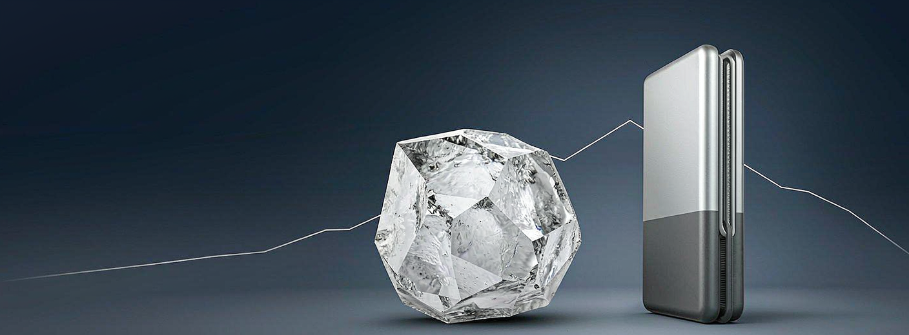

> 数据截止：2026年9月2日13:08（北京时间）。A股处于盘中，H股为午间休市前行情；阶段涨跌比较统一使用9月1日收盘价。财务口径以中国企业会计准则为主，辅以公司H股中期业绩公告复核。

## 先说结论

赣锋锂业是一家“上游资源+中游锂盐+下游电池”的全产业链锂企业。它的主要利润仍然来自锂价和自有资源，储能电池和固态电池是增长选项，尚不是估值主锚。

公司2026年上半年的修复是真的：营收230.97亿元，归母净利42.57亿元，扣非净利38.48亿元。但当前不是周期底部定价。9月2日电池级碳酸锂参考价约15.6万元/吨，处在过去一年的中高区间；A股49.88元对应约1045.8亿元总市值，已经要求公司维持约75亿至87亿元的可持续年利润，并不便宜。

我的当前判断是：

- **A股：持有/观望，不适合追涨建仓。** 12个月悲观、中性、乐观情景价值约为36.7元、49.7元和66.7元。当前价格基本落在中性值附近，胜率和赔率都不突出。
- **H股：相对A股更有吸引力，但还不是低风险买点。** 37.82港元按9月2日1港元兑0.86497元人民币的中间价折合约32.71元人民币，较A股折价34.4%。情景价值约为27.6、40.2和57.8港元，但这个测算已假设A/H折价由当前34%收窄至25%—35%；若折价完全不收敛，H股的估值优势不会自动变成收益。汇率见[中国外汇交易中心当日中间价](https://news.smm.cn/news/104091937)。
- **更好的策略是等价格或等证据。** A股进入40—44元后，才接近历史PB中位和中性价值的8折区域；如果不跌价，则需等待锂价稳在15万元/吨以上、现金流改善和自有资源放量共同确认。

## 它到底靠什么赚钱

赣锋有三层业务，但对股东价值的重要性并不平均。

**第一层是锂资源。** 公司在澳大利亚、阿根廷、马里、塞拉利昂和中国布局锂辉石、盐湖和锂云母。重点项目包括：

- Mount Marion锂辉石项目持股50%，披露资源量222万吨LCE（碳酸锂当量），升级后预计2028年前形成年60万吨折6%品位锂精矿产能。
- 马里Goulamina项目持股65%，披露资源量982万吨LCE；一期年50.6万吨锂精矿产能于2025年投产，2026年上半年生产23.38万吨，已接近满产节奏。
- 阿根廷Cauchari-Olaroz盐湖持股46.67%，一期设计产能4万吨LCE/年，2026年上半年生产1.9万吨碳酸锂；二期规划4.5万吨。
- Mariana盐湖一期2万吨氯化锂已投产；PPGS整合后公司预计持有67%权益。
- 墨西哥Sonora披露资源量882万吨LCE，但矿产特许权被取消后已进入ICSID仲裁；在本研究估值中只当作低概率期权，没有当作正常经营资产。

上述资源量大多为项目100%口径，不等于赣锋权益资源量，更不等于已探明储量或可立即变现的NAV。把这些数字直接相加再乘锂价，会严重高估公司价值。项目进展和资源口径来自公司[2026年中期业绩公告](https://www1.hkexnews.hk/listedco/listconews/sehk/2026/0828/2026082803929_c.pdf)。

**第二层是锂盐加工。** 这是当前的核心利润池。上半年锂系列产品营收141.97亿元，毛利率42.44%，贡献约82.8%的集团毛利。资源自给率越高、盐湖和低成本矿放量越顺利，锂价上涨时留在公司内的利润越多。反过来，当锂价下跌，高成本外购矿、存货减值和在建项目会同时放大压力。

**第三层是锂电池。** 上半年电池业务营收78.31亿元，毛利率只有12.43%，分部税前利润约3.97亿元。储能电芯产能利用率接近100%，588Ah大电芯计划2026年三季度开始爬坡，500Wh/kg级10Ah锂金属电池已小批量生产。这些是真实业务进展，不是纯概念；但低毛利和尚小的利润贡献也意味着，现在不应该按“固态电池龙头”给整家公司大幅加估值。

## 行业处在什么位置

碳酸锂在2026年上半年经历了先涨、5月见高、随后回落的过程。公司中报引用的第三方数据显示，上半年5%—6%锂辉石中国到岸价从年初约1560—1590美元/吨上升至6月的2150—2270美元/吨。电池端需求也很强：中国上半年动力和储能电池销量同比增长48.6%，其中储能电池增长83.4%。

但需求好不等于价格只涨不跌。同一份中报引用长江证券预估，2026年全球锂资源供应约197.5万吨LCE，同比增长27%；新增盐湖、非洲矿山和拟复产项目会在高价下加快回归。截至9月2日，电池级碳酸锂参考基准价约15.6万元/吨，过去一年均值约13.36万元/吨，最高约19.9万元/吨；碳酸锂LC2701合约约15.79万元/吨。现货和远月期货几乎平水，说明市场没有定价长期严重短缺。当日价格见[SMM锂价与广期所合约行情](https://www-old.metal.com/Lithium)及[生意社基准价](https://finance.sina.com.cn/money/future/nyzx/2026-09-02/doc-iniqkvce1376278.shtml)。

因此，当前更像“周期修复后的高波动阶段”，还不能确认为可持续的周期上行。需要同时看到现货库存持续去化、高成本产能退出、下游排产不降和新项目投产延后，才能把15万元以上的锂价当作新中枢。

## 财务修复很强，现金转化仍是短板

| 期间 | 营收（亿元） | 归母净利（亿元） | 毛利率 | 经营现金流（亿元） | 资产负债率 |
| --- | ---: | ---: | ---: | ---: | ---: |
| 2021 | 111.62 | 52.28 | 39.81% | 26.20 | 33.00% |
| 2022 | 418.23 | 205.04 | 49.50% | 124.91 | 38.27% |
| 2023 | 329.72 | 49.47 | 13.68% | 1.46 | 42.95% |
| 2024 | 189.06 | -20.74 | 10.82% | 51.61 | 52.80% |
| 2025 | 230.82 | 16.13 | 15.72% | 29.45 | 54.23% |
| 2026H1 | 230.97 | 42.57 | 31.51% | 13.28 | 55.12% |

2021—2025年数据由公司[2025年年报及过去五年财务摘要](https://www1.hkexnews.hk/listedco/listconews/sehk/2026/0430/2026043002396.pdf)与中国准则财务报表核对；2026H1来自最新半年报。

这张表有三个结论。

第一，赣锋是标准的强周期资源股。同样的产业链，2022年能赚205亿元，2024年却亏损20.7亿元。当期PE最低的时候，往往正是周期利润最高的时候。

第二，2026年上半年利润不主要靠会计公允价值。归母净利42.57亿元，扣非后仍有38.48亿元。但投资收益11.30亿元，其中包括出售部分PLS股票以及联营、合营企业收益，仍要从经营利润中分开看。最新中报数据可在[公司半年报全文](https://money.finance.sina.com.cn/corp/view/vCB_AllBulletinDetail.php?id=12570920&stockid=002460)与[H股中期业绩公告](https://www1.hkexnews.hk/listedco/listconews/sehk/2026/0828/2026082803929_c.pdf)交叉核对。

第三，现金流赶不上利润。上半年经营现金流只相当于归母净利的31%。期末应收账款从67.72亿元增加到95.07亿元，存货从130.02亿元增至151.50亿元，较年初合计增加约48.8亿元。这可以由业务扩张和价格上涨部分解释，却不能被忽略。

资产负债表也要留出安全折价。截至6月末，集团现金及现金等价物109.60亿元，有息银行及其他借款约355.32亿元，加上应付债券后的净有息债务约260亿元；上半年融资成本6.47亿元。在建工程155.92亿元，已签约未计提的厂房和机器资本承诺33.15亿元。这些投资为未来产量铺路，也使公司在锂价下行时更难迅速收缩。

每股价值还有稀释问题。2025年公司配售4003万股H股，并发行13.7亿港元可转债，其中大部分已转换为3950万股H股，总股本由20.17亿股增至20.97亿股，稀释约3.9%。这一融资确实补充了资金，但说明公司的全球扩张并不只由自由现金流支撑。详见[新增H股配售及可转债公告](https://static.cninfo.com.cn/finalpage/2025-09-03/1224634192.PDF)。

## 与同行比，它贵不贵

| 公司 | 2026H1营收（亿元） | 归母净利（亿元） | 毛利率 | 经营现金流（亿元） | 盘中总市值（亿元） | 简单年化PE | PB |
| --- | ---: | ---: | ---: | ---: | ---: | ---: | ---: |
| 赣锋锂业 | 230.97 | 42.57 | 31.51% | 13.28 | 1,046 | 12.3倍 | 2.17倍 |
| 天齐锂业 | 122.42 | 42.42 | 64.39% | 22.12 | 806 | 9.5倍 | 1.67倍 |
| 中矿资源 | 36.60 | 11.11 | 52.90% | -2.27 | 355 | 16.0倍 | 2.68倍 |
| 雅化集团 | 67.09 | 12.16 | 31.70% | -4.13 | 205 | 8.4倍 | 1.69倍 |

PE以上半年净利简单乘二计算，只是同口径对比，不代表下半年真能复制上半年。同行数据来自已披露的[天齐锂业2026年半年报](https://static.cninfo.com.cn/finalpage/2026-08-28/1225522275.PDF)、[中矿资源2026年半年报](https://static.cninfo.com.cn/finalpage/2026-08-25/1225496181.PDF)和[雅化集团2026年半年报摘要](https://money.finance.sina.com.cn/corp/view/vCB_AllBulletinDetail.php?id=12537932&stockid=002497)。

赣锋的优势是产品组合、全球资源和电池业务更分散，并且低成本项目正在爬坡。它的弱点是电池业务拉低整体毛利率，重资产扩张和净债务也高于部分同行。从当期估值看，赣锋并不比天齐和雅化便宜；市场已经为它的多元布局和长期期权支付了部分溢价。

## 最近股价为什么这样走

9月2日13:08，A股报49.88元，跌5.04%，成交额约15.19亿元；H股午间休市前报37.82港元，跌6.57%。同日碳酸锂期货主力合约一度跌近4%，天齐、中矿、雅化均下跌4%—6%。这是板块对锂价回落的共振，而非赣锋当日独有的负面公告。盘中行情可在[腾讯证券行情接口](https://qt.gtimg.cn/q=sz002460,hk01772,sz002466,sz002738,sz002497)复核。

| 标的 | 近1个月 | 近3个月 | 近1年 | 2026年初至今 |
| --- | ---: | ---: | ---: | ---: |
| 赣锋锂业A | +4.2% | -23.7% | +32.2% | -16.3% |
| 赣锋锂业H | +7.2% | -34.3% | +32.6% | -22.1% |
| 沪深300 | +1.5% | -6.2% | +2.7% | -0.4% |
| 电池ETF（561160） | -2.1% | -23.4% | +13.3% | -15.5% |
| 天齐锂业 | +7.6% | -19.7% | +15.6% | -11.1% |
| 中矿资源 | +8.7% | -13.3% | +29.8% | -33.3% |
| 雅化集团 | +4.5% | -16.7% | +38.8% | -24.1% |

赣锋A股在5月6日触及91.30元，到9月1日已回撤42.5%；近3个月的跌幅显著大于沪深300，与电池ETF接近。这说明市场在从“供应扰动+锂价上冲”的乐观叙事，退回到“库存、复产和需求能否接住”的事实定价。半年报利润落在之前36.5亿至46亿元的预告区间上沿，但未超出市场已知范围，不足以独立扭转趋势。

筹码并不轻。截至8月下旬，融资融券余额约41.7亿元，约占流通A股市值6.4%；质押总股数约1.48亿股，占总股本约9.2%。这些比例尚未到极端程度，但在商品价格快速回落时，杠杆资金会放大股价波动。与股价同期性有关的筹码数据只能做辅助观察，不能反推“机构已经吸筹”。数据见[赣锋锂业估值与筹码摘要](https://www.lixinger.com/equity/company/detail/sz/002460/2460/fundamental/valuation/pb)及[公司事件日历](https://data.eastmoney.com/stockcalendar/002460.html)。

技术位置只能做交易辅助。A股9月1日的20日、60日和120日均线约为53.46、57.12和67.11元，盘中价格低于三条均线；47—48元是7月以来的第一道支撑，若有效跌破，下一个更有基本面意义的区间是40—44元。这不是底部保证，只是风险收益开始改善的位置。

## 现在的价格到底贵不贵

对资源周期股，我不使用单一年PE给伪精确目标价。主方法是用周期情景下的预期净资产与PB定价，再用标准化利润PE独立校验。

| 情景 | 核心经营假设 | 2026E归母净利 | 2027E归母净利 | 主要估值假设 | A股12个月价值 | H股12个月价值 |
| --- | --- | ---: | ---: | --- | ---: | ---: |
| 悲观 | 碳酸锂2026H2回落至11—13万元/吨，2027年中枢10—12万元；复产快、现金流修复慢 | 55亿元 | 50亿元 | 2027E BVPS约26.2元×1.4倍PB | 36.7元 | 27.6港元 |
| 中性 | 锂价维持13—16万元/吨；Goulamina、C-O与锂盐产能正常爬坡，电池利润温和提升 | 70亿元 | 80亿元 | 2027E BVPS约27.6元×1.8倍PB；13倍PE校验得到49.6元 | 49.7元 | 40.2港元 |
| 乐观 | 需求强、供应投放延后，锂价维持16—19万元/吨；自有资源和大储能电芯顺利放量 | 93亿元 | 110亿元 | 2027E BVPS约29.0元×2.3倍PB；14倍PE校验上限约73.5元 | 66.7元 | 57.8港元 |

价格敏感性可以用一个粗略上限理解：若全年锂系列产品销量超过20万吨，锂产品均价每变动1万元/吨，收入端影响上限约20亿元；考虑外购矿价格联动、产品结构、库存时滞和所得税后，本模型估算对全年归母净利的影响约10亿至15亿元。这是敏感性假设，不是公司指引。

中性2027年利润假设低于市场一致预期。截至8月31日，12家机构对2026、2027年归母净利的平均预测约为70.6亿元和91.5亿元，区间非常宽；中性预测对2027年更保守，是因为当前锂价已低于上半年约16.1万元/吨的均价，且上半年现金转化率偏低。一致预期可见[同花顺盈利预测汇总](https://basic.10jqka.com.cn/48/002460/worth.html)；最近的乐观卖方预测将2026—2028年净利估为93亿、112亿和126亿元，见[东吴证券半年报点评](https://data.eastmoney.com/report/info/AP202608291828709696.html)。

情景权重取30%/50%/20%，只是根据当前期货价靠近中性区间、供需两端同时高增所做的研究权重，不是客观概率。加权后A股价值约49.35元，与盘中价几乎相同；H股在折价收窄假设下的加权价值约40.12港元，只有6%左右的研究上行空间。这两个数字都不支持“现在是大幅低估”的结论。模型可复算：[A股估值模型](/Users/chenzhian/workspace/ai/dreamble/tmp/2026-09-02-赣锋锂业-A股估值模型.json)、[H股估值模型](/Users/chenzhian/workspace/ai/dreamble/tmp/2026-09-02-赣锋锂业-H股估值模型.json)。

反向估值更直观。A股当前1046亿元左右的市值，按12倍周期中枢PE，要求公司长期稳定赚约87亿元；即使给14倍，也要求约75亿元。这与2026年一致预期的70.6亿元已非常接近。也就是说，当前价格不是在买“市场没看见的扭亏”，而是在买“今年利润能保持，明年还能继续增长”。

以净资产看，A股当前PB约2.17倍，高于过去十年约1.76倍的中位数；按最新每股净资产22.99元计算，1.76倍PB对应约40.5元，这是40—44元成为更合理观察区间的另一个依据。历史PB分位见[理杏仁估值数据](https://www.lixinger.com/equity/company/detail/sz/002460/2460/fundamental/valuation/pb)。

## 现在该怎么做

在未知持有周期和风险承受能力的情况下，以保守口径给出条件化策略：

- **已持有A股**：可以持有观察，但不因为半年报高增就加仓。若股价反弹至60元以上，而锂价仍在13—15万元/吨、现金流未改善，则估值会重新透支，应考虑降低暴露。
- **准备买A股**：40—44元是第一个有价值支撑的分批观察区；36—39元的安全边际更好，但前提是碳酸锂没有跌破10—11万元/吨并引发新一轮大额减值。
- **准备买H股**：当前比A股更便宜，但把握度尚不足以支持一次性重仓。32—35港元才会同时获得更好的基本面折价和A/H折价；若折价长期停在30%以上，要接受“公司价值上涨，H股仍然跑输A股”的可能。
- **短线交易**：A股当前低于20/60/120日均线，还没有趋势反转证据。仅当碳酸锂现货止跌、股价放量收回53—54元并保持数日，交易条件才明显改善。

我会在以下情况改变中性判断：

1. 碳酸锂现货连续两个月低于10.5万元/吨，同时库存上升：转向悲观情景。
2. 2026年下半年经营现金流仍低于净利的50%，并且净有息债务继续上升：将中性估值下调10%—15%。
3. Goulamina、C-O、Mariana或588Ah电芯产线爬坡明显延后：下调产量和业务期权价值。
4. 碳酸锂稳定在15万元/吨以上，公司连续两个季度经营现金流大于净利的80%，自有矿产量按计划增长：上调至乐观情景。

## 我最可能错在哪里

支持多头的最强证据，是锂价已经从2024—2025年低位明显修复，储能需求高增，Goulamina和C-O已有真实产量，并且上半年扣非利润已证明经营杠杆。若行业真正进入多年供需偏紧，本研究中性锂价假设就会过于保守，66—74元的乐观估值也可能被上调。

反对多头的最强证据，是锂价仍高于过去一年均值，高价会刺激复产和新供给；公司利润转化为现金的效率低，净债务和资本承诺又不小。此外，公司2024年曾因交易*ST江特股票构成内幕交易而被行政处罚；2026年7月检察机关决定对公司不起诉，刑事不确定性基本落地，但原行政违法事实并未因此撤销。见[公司《不起诉决定书》公告](https://static.cninfo.com.cn/finalpage/2026-07-11/1225418918.PDF)。

后续只需紧盯八个数：每周碳酸锂现货与期货基差，每月库存和正极材料排产，每季度锂系列产品毛利率、经营现金流/净利、存货、应收账款和净有息债务，以及Goulamina、C-O和Mariana的产量爬坡。这些数据比一次股价大涨、一条固态电池新闻或单月锂价反弹更能决定长期价值。

最后用一句话收束：**赣锋锂业是值得长期跟踪的锂资源龙头，但A股当前价格已接近中性价值；最大风险是锂价下行与现金流偏弱同时发生，真正有吸引力的买点需要更低价格，或更强的经营验证。**

市场有风险，以上为研究和决策参考，不构成收益承诺；具体操作需结合资金期限、风险承受能力和最新信息独立判断。
