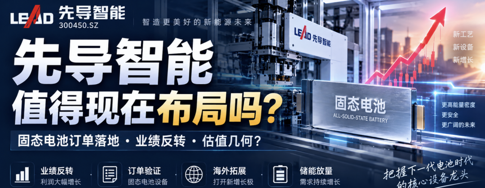

## 先说结论

**我目前对先导智能的判断是“基本面反转已经成立，固态电池逻辑开始从题材走向订单验证，估值已经回到可以做中期布局的位置；但今天大涨后，不建议直接重仓追”。**

截至今天 9 月 15 日收盘，先导智能约 **31.55 元，上涨 5.59%**，对应总市值约 **528 亿元**。更值得注意的是，今天创业板指下跌 1.15%、宁德时代跌超 6%，全市场超过 4300 只股票下跌，先导智能却逆势大涨，说明今天不是简单跟随锂电板块，而是公司自身的固态电池订单信息在形成明显的超额收益。

我的 6—12 个月基础目标价放在 **40—45 元**，中枢约 **42 元**；如果固态电池量产设备、海外大单和储能设备三条线同时兑现，乐观情景可以看到 **50 元以上**。但技术上现在还只是从超跌区向上修复，**32.2—32.5 元附近是第一道确认位，33.5—35 元是更重要的套牢区**。

* * *

## 一、为什么我现在开始重新重视先导智能

市场过去几年看先导智能，基本就是一个逻辑：

> 宁德时代、亿纬锂能这些电池厂扩产 → 买设备 → 先导赚钱。

这个模式的问题非常明显：**强周期。**

2022 年锂电扩产高峰之后，设备订单急剧下滑，先导智能净利润从 2022 年的 23.18 亿元，降到 2023 年的 17.75 亿元，再到 2024 年只剩 **2.86 亿元**。所以过去两年市场不是不知道它是龙头，而是不愿意给周期设备公司高估值。

但从 2025 年开始，公司进入新一轮经营拐点：

| 指标 | 2023 | 2024 | 2025 | 2026H1 |
| --- | --- | --- | --- | --- |
| 营收 | 166.28亿 | 118.55亿 | 144.43亿 | 81.89亿 |
| 归母净利润 | 17.75亿 | 2.86亿 | 15.64亿 | 9.56亿 |
| 经营现金流 | \-8.63亿 | \-15.67亿 | +49.57亿 | +40.85亿 |
| 净利率 | 约10.7% | 约2.4% | 约10.8% | 约11.7% |
| ROE | 15.31% | 2.44% | 12.65% | 5.67% |

2025 年营收增长 21.83%，净利润增长 **446.58%**，经营现金流从 2024 年的 -15.67 亿元直接改善到 **+49.57 亿元**；2026H1又实现营收 +23.88%、净利润 +29.15%、经营现金流 +73.57%。

所以现在已经不是“等待业绩反转”。

**业绩反转已经发生。**

现在真正的问题变成：

**这轮反转能持续多久，以及固态电池能不能把先导从传统锂电设备龙头重新定价成下一代电池设备平台。**

这是估值能不能从 20 倍重新往 25—30 倍走的核心。

* * *

## 二、2026H1比利润增长更重要的是“订单质量”

半年报最漂亮的数据其实不是净利润增长 29%，而是三项资产负债表和现金流数据。

第一，经营现金流 **40.85 亿元**，而同期归母净利润只有 9.56 亿元。

公司上半年购买固定资产、无形资产等资本开支约 1.79 亿元，如果简单用：

**自由现金流 ≈ 经营现金流－资本开支**

那么上半年自由现金流约 **39.1 亿元**。

当然，不能把这 39 亿简单理解成以后每半年都能赚这么多现金，因为其中很大部分来源于客户预付款和营运资本变化。但它至少证明了一件很重要的事情：

**以前困扰设备公司的“利润有了、钱没回来”，正在明显改善。**

第二，截至 6 月底，公司合同负债达到：

**174.03 亿元。**

2025 年底只有 128.73 亿元，半年增加了约 **45.3 亿元**。与此同时，存货达到 **168.73 亿元**。

这两个数据要一起看。

合同负债本质上大量是客户已经支付、但设备还没有完成验收确认收入的预付款。它增长到接近公司一整年收入规模，是未来收入能见度的重要证据。

而存货高达 168.7 亿，说明大量设备正在生产、运输、安装或者等待客户验收。

所以我对它的理解是：

**174 亿合同负债 + 169 亿存货 = 强订单能见度，同时也是验收风险。**

这是一把双刃剑。

如果客户按计划扩产、设备顺利验收，这些存货和合同负债会逐渐转化成未来收入利润；但如果电池厂推迟项目、改变技术路线或者海外项目延期，那么存货减值风险同样会冒出来。

这也是研究先导智能时最应该盯的数据，而不是每天追着新闻看订单。

* * *

## 三、固态电池：这一次不是简单“蹭概念”

这是我认为先导智能目前最关键的估值变量。

今天公司刚刚在互动平台明确表示：

**三季度以来持续获得头部客户固态电池设备订单，多家客户产线正在并行交付，涉及干法电极、电解质涂布、转印、固态叠片、等静压等核心设备。**

注意这几个词：

不是“技术储备”。

不是“正在研发”。

也不是“产品可用于固态电池”。

而是：

**订单 + 头部客户 + 并行交付。**

这是完全不同的产业阶段。

2026 年半年报也已经明确披露，公司能够提供从材料制备、极片加工、电芯组装一直到高压化成分容的全固态电池整线方案，包括：

**干法/湿法混料涂布 → 超高精度锂箔 → R2R镀锂 → 固态电解质膜覆合转印 → 高速高精切叠 → 温等静压 → 高压化成分容。**

这意味着先导和很多A股“固态电池设备概念股”的本质区别在于：

**它不是赌某一个工序，而是赌整个固态电池产线资本开支。**

如果未来全固态电池产业化，最大的受益方向之一不是单纯材料，而是：

> 新工艺出现 → 原有湿法锂电设备大量不兼容 → 电池厂重新买设备。

其中新增设备包括干法电极、固态电解质成膜、转印、等静压、高压化成等等。

设备产业链的资本开支弹性会非常大。

所以在A股固态设备链里面，我会把先导放在：

**第一梯队、强业务相关。**

利元亨也是强相关；部分其他所谓固态设备概念，则更多还是单设备、小批量验证甚至产业映射。

但这里必须降温一点。

**目前公司没有单独披露固态电池收入和利润金额。**

因此现在还不能说固态已经成为第二主业。

正确的估值方法应该是：

> 传统锂电+储能设备利润决定底部估值，固态电池决定估值溢价。

不能反过来拿2030年的固态电池市场空间直接倒推今天利润。

* * *

## 四、现在真正支撑利润的，还是传统锂电+储能

2026H1公司总收入81.89亿元，其中：

锂电池智能装备收入 **61.21亿元，同比增长34.66%**，占公司收入约75%，毛利率32.64%；智能物流收入11.58亿元，同比增长 **172.14%**；出口收入24.40亿元，同比大增 **111.39%**，占总收入接近30%。

所以目前先导智能真正的利润发动机仍然是：

**锂电设备复苏 + 储能扩产 + 海外市场。**

而不是固态。

这一点非常重要。

尤其现在全球储能扩产速度已经明显高于单纯动力电池扩产，公司交流会纪要显示，上半年新签订单超过 **180亿元，同比约增长50%—60%**，二季度单季约90亿元，国内锂电约占60%，海外约20%；储能、固态、钠电等增速高于整体。这个数字来自业绩交流会纪要，并非定期报告中的审计财务数据，因此我把它作为订单趋势参考，而不直接拿来确认收入。

如果这个订单增速最终持续兑现，那么2027年的利润增长确定性会明显比市场此前预期更高。

* * *

## 五、一个非常值得注意的问题：毛利率仍在下降

这是多头不能回避的问题。

2026H1：

设备制造毛利率只有 **31.90%**，同比下降1.83个百分点；

其中锂电设备毛利率32.64%，下降2.42个百分点；

智能物流17.68%，下降4.09个百分点；

出口业务毛利率33.72%，同比下降 **6.55个百分点**。

公司的整体毛利率过去几年实际上一直是往下走的：

2023 年约35.6% → 2024年约35.0% → 2025年约33%左右 → 2026H1约32%。

所以这轮利润恢复，目前更多来自：

**收入规模恢复 + 费用率下降 + 回款改善 + 产能利用率恢复**

而不是设备越来越赚钱。

这也是我为什么目前不给它30—35倍2027E PE的重要原因。

如果未来出现两个信号：

**固态设备收入开始放量，而且毛利率明显高于传统锂电设备；海外毛利率重新回到40%左右。**

那先导的估值体系才可能发生第二次跃迁。

* * *

## 六、财务质量其实比市场想象的更好

还有几个容易被忽略的数据。

2026H1研发投入 **8.27亿元**，占收入大约10.1%，基本没有因为行业低谷削减研发。

货币资金已经达到 **129.67亿元**，但这里面包含2026年H股上市募集资金，因此不能全部当作经营产生的“净现金”。与此同时，公司总资产498.3亿元、总负债318.9亿元，资产负债率约 **64%**。

乍一看64%负债率不低。

但先导这种设备公司需要把负债拆开看。

其中合同负债就有174亿元，本质上很大比例是**客户预付款**，并不是银行债务。

所以它的真实财务杠杆，远没有64%这个数字看起来那么危险。

按照H1归母利润简单年化、平均总资产估算，当前ROA约 **4.3%**；H1 ROE 5.67%，如果下半年盈利保持增长，全年ROE重新回到两位数没有太大难度。

真正应该担心的反而是：

**应收账款78.23亿元 + 存货168.73亿元。**

大型非标设备企业最后拼的不是“接多少订单”，而是：

**能不能按期验收、按期收钱。**

* * *

## 七、同业比较：为什么先导应该享受龙头溢价

最适合比较的是赢合科技、杭可科技、利元亨。

| 2026H1/近期指标 | 先导智能 | 赢合科技 | 杭可科技 | 利元亨 |
| --- | --- | --- | --- | --- |
| 市值约 | 528亿 | 132亿 | 122亿 | 52亿 |
| H1营收 | 81.89亿 | 60.90亿 | 21.53亿 | 19.60亿 |
| H1归母净利 | 9.56亿 | 3.51亿 | 1.54亿 | 0.39亿 |
| H1毛利率 | ~32.0% | ~20.2% | ~28.5% | ~24.4% |
| H1净利率 | ~11.7% | ~5.8% | ~7% | ~2.0% |
| H1 ROE | 5.67% | ~5.0% | ~2%-3% | ~1.7% |
| TTM PE附近 | ~29.7x | ~21x | ~51x | ~90x |
| PB附近 | ~2.94x | ~1.8x | ~2.2x | ~2.2x |
| PS附近 | ~3.3x | ~1.2x | ~3.8x | ~1.5x |
| EV/EBITDA参考 | ~16-17x | ~12.6x | 2026E约25x | ~22-26x |

不同平台TTM、扣非和EV口径存在差异，因此表里的估值适合做横向判断，不宜机械比较个位数的小数差异。赢合近期PE/PB约21.4/1.78倍；杭可扣非TTM PE约51倍；利元亨近期PE仍在90倍左右。

这个表很有意思。

如果单看PE：

先导比赢合贵。

但看盈利能力：

先导毛利率比赢合高十几个百分点，净利率大约是赢合两倍，同时具备更完整的整线能力、海外客户和固态电池全线布局。

反过来，和杭可、利元亨相比，先导的盈利确定性又明显更强，而估值反而不高。

所以我认为：

**先导相对赢合应该享受20%左右龙头溢价，但目前不应该给到传统成长股30—40倍的估值。**

目前大约21倍2026E PE，我认为属于：

**合理偏低。**

* * *

## 八、估值：31.55元到底贵不贵

截至9月12日，16家机构的一致预期为：

2026年EPS **1.48元**，归母净利润24.80亿元，同比增长58.6%；2027年EPS **1.97元**，归母净利润33.03亿元；2028年EPS2.46元，净利润41.25亿元。

按31.55元计算：

**2026E PE ≈21.3倍**

**2027E PE ≈16.0倍**

这就是现在先导最大的吸引力。

因为今年早些时候市场炒固态电池时，先导曾经涨到接近70元，估值里包含了非常高的固态电池产业化预期。

目前31.55元，相对52周高点约69.72元已经回撤约 **55%**；相对2025年底49.98元，今年以来仍下跌约 **37%**。

所以过去几个月，本质上发生的是：

**业绩继续向上，但估值大幅杀下来。**

这类组合往往比“股价涨、盈利预测也涨”的股票更值得重新研究。

当前TTM PE约29.7倍、PB约2.94倍、PS约3.3倍；第三方EV/EBITDA口径大约16—17倍。2025年度A股每10股派2.87元，对应目前股价静态股息率只有约 **0.9%**，所以它显然仍然是一只成长/周期股，而不是红利资产。

* * *

## 九、我的估值模型

我不采用今年初那些60—70元目标价。

因为市场风险偏好已经发生变化。

我的核心锚是2027年利润。

悲观情景是固态放量推迟、传统锂电扩产不及预期，2027 EPS只能做到1.55—1.65元，同时估值压到16—18倍，对应合理价格约 **25—30元**。

基准情景采用目前一致预期附近，2027 EPS约1.9—2.0元，考虑行业龙头、海外和固态期权，给予 **20—23倍PE**，对应：

**38—46元。**

所以我的基础合理价值区间是：

**40—45元，中枢约42元。**

乐观情景则要求固态设备明显贡献收入、海外毛利率回升、订单持续高速增长，2027 EPS达到2.2—2.3元，并重新获得24—26倍成长估值，对应：

**53—60元。**

这个价格不是不能到。

但需要用业绩证明，而不能仅靠固态电池新闻。

值得参考的是，近几个月机构目标价仍主要集中在44—51元附近，市场一致目标价约49.8元。

我的40—45元反而相对保守。

* * *

## 十、技术面：今天的大涨意义很大，但还不能叫反转

9月14日收盘只有29.88元，此前股价已经连续回调，9月11日最低到了 **29.02元**，短周期RSI一度进入严重超卖区，且过去10个交易日主力资金累计净流出约4.38亿元。

今天借固态订单消息逆势上涨5%以上，性质上属于：

**超跌+基本面催化共振。**

而不是纯技术反抽。

但现在上面依然有明显套牢盘。

我关注三个位置：

**29—30元：核心短期支撑。**

**32.2—32.5元：第一突破确认位。**

**33.5—35元：真正决定这一波能不能形成中期趋势的压力区。**

如果接下来能够放量站稳32.5，并进一步突破35元，那么这轮行情就可以从“超跌反弹”升级为：

**基本面驱动的趋势反转。**

如果今天之后重新跌破29元，那么意味着市场仍然把固态订单当作短期事件交易。

* * *

## 十一、具体操作建议

我现在给先导智能的评级是：

**中线“分批买入”，短线“不追高”。**

激进型投资者可以把31元附近作为观察性底仓区域，但今天涨了5%以上，不建议一次性买满。比较好的方式是先配置计划仓位的20%—30%，如果随后有效站稳32.5元，再加一部分；突破35元后再确认趋势。交易止损可以放在 **28.5—29元**区域。

稳健型投资者，我更建议等两种情况之一：要么回踩 **30—31元**不破；要么成交量配合突破32.5—33元后，再开始建仓。6—12个月第一目标 **38—40元**，第二目标 **43—45元**。

长期投资者则不必纠结一两块钱。我更倾向三段式配置：30—32元第一笔；如果市场系统性风险把它重新压到28—30元，第二笔；第三笔等三季报/四季度订单和固态量产设备确认之后再买。对于普通组合，我建议单只设备股最终仓位控制在 **5%—10%**；高风险偏好也不建议轻易超过15%。

这里还有一个非常好的“基本面止损”标准：

如果未来连续两个季度出现**新签订单明显减速、合同负债下降、经营现金流恶化、存货继续上升，同时毛利率下降**，那比股价跌破某一条均线更加值得卖出。

* * *

## 十二、我认为市场目前最大的误判

先导智能现在最容易产生两个极端观点。

一种认为：

> 固态电池都是炒概念。

我认为这是错的。

公司已经出现头部客户交付和重复订单，而且今天进一步确认三季度多个客户产线并行交付，固态设备与先导是真业务关系，不是“蹭热点”。

另一种认为：

> 固态电池快爆发了，所以先导一定值60、70元。

我认为也太早。

目前固态设备收入到底是多少，公司并没有拆出来。

所以现阶段最合理的投资逻辑应该是：

**传统锂电和储能设备给你利润安全垫，海外扩张提供成长，固态电池给估值期权。**

而不是拿固态电池当2026年主营业务去估值。

这恰恰是我现在愿意重新关注先导的原因。

* * *

## 最终判断

如果让我现在只用一句话评价先导智能：

**这是一个“业绩已经反转、估值已经杀下来、下一代技术又开始出现真实订单”的龙头，31元附近赔率已经明显好于今年50—60元的时候。**

但我不会因为今天一根5%的阳线就重仓。

我现在认为比较舒服的布局区是 **29.5—32元**，12个月基础合理价值 **40—45元**；突破35元以后，技术面才真正转强；如果固态设备在2027年开始出现可量化收入贡献，估值上限可以进一步打开到 **50—60元**。

最重要的五个后续变量只有：**三季度新签订单、合同负债、固态电池设备订单金额/收入占比、海外毛利率、存货向收入转化速度。**

其中我最看重的不是下一条固态新闻，而是**三季报合同负债和存货的变化**。如果174亿元合同负债继续增长，而库存开始下降、收入加速确认，那会是比任何概念新闻都强得多的买入信号。

* * *

市场有风险，以上属于基于公开信息和盈利假设的研究判断，不代表收益承诺，估值和目标价会随订单、财报及市场风险偏好变化。
