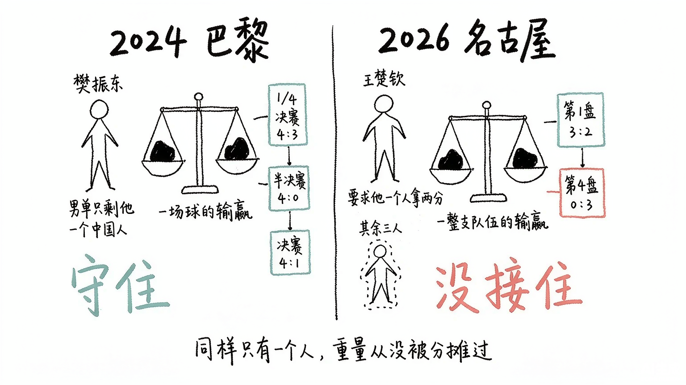
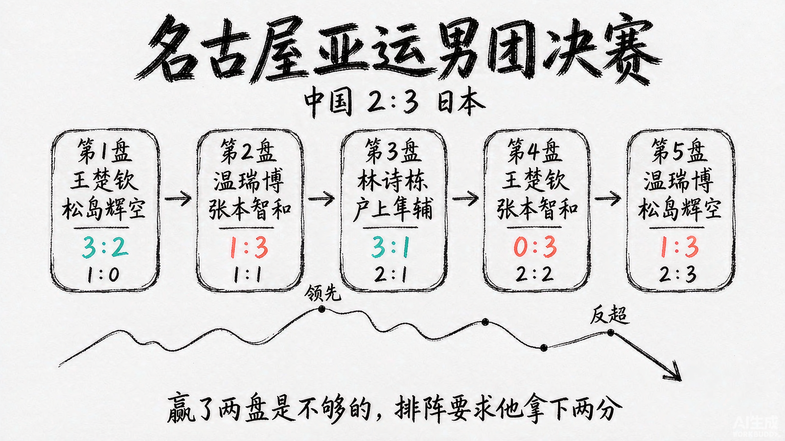
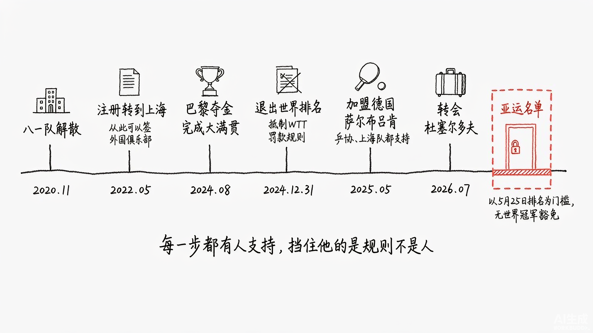

2024年8月，巴黎。樊振东对张本智和的那场四分之一决赛，打到了第七局。

他0比2落后，又被逼到2比3。局间他回更衣室换了一件球衣。

重新上场，他改了发球和接发球的线路，连扳两局，4比3。

这不是金牌战。但很多人后来说，那才是那届奥运会真正的一场决赛。

因为那场球要是输了，后面就没有金牌战了。

## 他守的不是一块金牌，是一条不能断的线

赛前没人想到会变成这样。

王楚钦是赛会头号种子、世界第一。他在32进16的比赛里2比4输给了莫雷加德，止步32强。上半区就这样没了。

男单赛场上只剩樊振东一个中国人。

而他所在的下半区，赛前就被叫做"死亡半区"：张本智和、费利克斯·勒布伦、林昀儒，全在里面。

于是有了那场七局大战。0比2落后，被逼到2比3，换球衣，改线路，4比3翻过来。

然后是半决赛，对东道主选手勒布伦，4比0。

最后是决赛，对瑞典人莫雷加德——正是淘汰王楚钦的那个人。先丢一局7比11，接着11比9、11比9、11比8、11比8，连扳四局。这条大满贯之路他走了八年：2016年第一个世界杯冠军，2021年世乒赛，然后是这一晚。他成为世界乒坛第十一位大满贯得主。

他自己总结这一路："每一场球都相当于决赛，每一场球都不容有失。"

他后来说过两句话。

一句是："国家信任我、队伍信任我，这一战只许赢不许输。"

另一句是，他担心"国乒多年的光荣历史会断送在自己手里"，因为"如果中国队单打一个项目无缘奖牌的话，我觉得是不可想象的"。

但那天晚上真正悬着的，其实是另一条线。

从2008年北京开始，中国选手连续四届奥运会包揽男单冠亚军。这个纪录在巴黎断了——王楚钦提前出局，会师从计划变成泡影，樊振东就算一路赢下去，决赛对面也坐着外国人。

没断的是另一条：奥运男单金牌，2008年马琳、2012年张继科、2016年和2020年的马龙，连续五届没旁落。而这一届，这枚金牌留不留得住，取决于一个人。

那天晚上，这条线细到了极点，线上只有他一个人。

这条线上一次出问题，是2004年的雅典。

那年的男单决赛，王皓2比4输给韩国的柳承敏。这是中国男乒最后一次丢掉奥运单打金牌，后面二十年的故事，就是从这块丢掉的金牌开始的。

所以"2004年柳承敏之后第一个闯进奥运男单决赛的非中国选手"这句话，在巴黎的语境里不是背景资料。它的意思是：**上一次中国人在奥运男单决赛对面看到一个外国人，那块金牌是丢了的。**

而二十年后站在同一侧场边的人，还是王皓。2004年丢掉这枚金牌的是他，2024年作为主管教练把樊振东送上这枚金牌的也是他。

这条线断在谁手里，又由谁在场边看着它被接住，中间隔了整整二十年。

## 两年后，同样的重量换了人扛，这次没接住

2026年9月24日，名古屋。

亚运会男团决赛，中国队2比3输给日本队。五盘打成这样：

第一盘，王楚钦对松岛辉空，0比2落后，连扳三局，3比2。这一分拿得极苦。

第二盘，19岁的温瑞博第一次站上亚运决赛台，对张本智和，1比3。

第三盘，林诗栋对户上隼辅，3比1，中国队2比1领先，几乎摸到奖杯。

第四盘，王楚钦再上，对张本智和，0比3。

决胜盘，温瑞博对松岛辉空，1比3。

银牌。亚运男团的连冠纪录，就此终结。

很多人把火撒在王楚钦身上。他自己把责任揽了过去："有很大部分原因在我这里。"

但这不是一个人的问题。

来看这套排阵的死穴：它要求王楚钦一个人拿两分。

第一盘拼松岛辉空，他已经把体力和精神都掏空了。中间只隔两盘，第四盘再上，对面是早就研究透了他的张本智和。0比3，整场没找到自己的节奏。

不是王楚钦不够强。他是现在毫无争议的世界第一：2026年澳门世界杯男单冠军（4比3逆转松岛辉空）、伦敦世乒赛十战全胜当选MVP、亚洲杯冠军、新加坡大满贯冠军，世乒赛和世界杯单打冠军在手，只差一枚奥运单打金牌就是大满贯。今年5月，他被任命为国乒男队队长。

问题在别处：**一支需要核心在两盘里都是无敌的队伍，容错率是零。**

## 他为什么不在那儿：不是被赶走的，是被规则留在门外的

输了球，全网第一反应是找樊振东。

他连这次亚运的名单都没进，人还在欧洲打俱乐部联赛，却被推上热搜。赛前亚奥理事会的宣传海报把他放在乒乓球项目的C位，丢冠之后这张海报被翻出来反复对比。

先把时间线摆清楚。

樊振东1997年生于广州，长期效力八一乒乓球队。2020年11月，军队专业体育力量调整改革，八一乒乓球队解散。此后在各省市与运动员的双向选择下，2022年5月起，他的注册代表资格转到上海。

这一步是后来一切的前提：现役军人不可能以个人身份跟外国俱乐部签合同，地方注册职业球员才可以。

2024年8月巴黎夺金、完成大满贯。同年12月31日，他与马龙、陈梦一起正式退出世界排名，起因是不接受WTT"不参赛就罚款"的规则。中国乒协当天发布声明，表示理解并尊重，已办完所有手续。

2025年5月底，德国萨尔布吕肯俱乐部宣布签下他。8月31日德甲首秀，他先以2比3输给法国选手鲁伊兹，又以1比3输给德国名将杜达，球队也输了。一个奥运冠军的德国首秀，以两场单打失利收场。

之后他带队拿下联赛、德国杯和欧冠，个人当选赛季最佳球员。2026年3月，他转会杜塞尔多夫，签约一年，7月1日生效。

关键在于：**他去德国不是决裂。** 2025年7月他接受专访时说得很明白，奥运会后他就跟刘国梁主席沟通过想去欧洲打联赛，"当时他也是很支持"，上海队的领导和教练同样支持。

那为什么进不了亚运名单？

据媒体报道，本届亚运的选拔以5月25日的国际乒联单打世界排名为硬性门槛，排名前三直接入选，没有世界冠军的豁免条款。樊振东退出排名后积分清零，没有排名就没有入选通道。

**一个为运动员权益抗争的人，被规则反噬，连为国出战的资格都拿不到。**

这不是谁在故意卡人。这是两套规则——WTT的商业赛历和国家队选拔办法——各管各的，没有人负责把它们对齐，而球员是唯一的夹心层。

现任中国乒协主席王励勤公开表示，正在与樊振东沟通，希望他回来代表国家征战。但只要选拔规则不改、排名不恢复，沟通到洛杉矶也回不来。

## 真正塌的不是一场球，是三十年来从没被分摊过的重量

先泼一盆冷水。

把这场失利算在"没带樊振东"头上，是情绪化的归因。2026年伦敦世乒赛团体赛，中国队3比0横扫日本夺冠，那支队伍同样没有樊振东和马龙——赢的时候，没人提缺人这件事。

樊振东回来能提升容错率，但他救得了一届大赛，救不了梯队。温瑞博该交的学费还得交。

真正的问题有三层。

**第一层，容错率。** 阵容厚度不够，排阵的容错率就极低；容错率低，核心状态一波动就满盘皆输。这条链条的起点不在名古屋的球台上，在名单产生的那一刻。

**第二层，换代节奏撞上了大赛周期。** 中国队这次是一老带四新，五个人里只有王楚钦有过亚运参赛经验，19岁的温瑞博第一次打大赛就被推到决赛二号位。拿亚运男团决赛当新人的学费，这个代价是不是太大，值得问。而日本那边是二十年青训的积累——他们等这枚金牌等了六十年。

**第三层，也是最深的一层：心理压制没了。**

据报道，张本智和赛后说过一句话，大意是现在面对中国年轻选手，以前那种无形的压力已经消失了。

这句话比比分更扎心。过去国乒最锋利的武器从来不是技术——马龙、樊振东往那儿一站，对手先输三分。现在对手上来就敢打，因为他们知道你后面没人了。

我们失去的不是一场球，是"未战先怯"这四个字。

## 别急着喊他回来

巴黎之后，樊振东遇到过一件很怪的事。

他在专访里说：奥运会后他调整休息，明明没参赛，讨论热度却完全没有降下来，"而且从比赛的输赢变成了你为什么不参赛，会讨论一些你的生活、朋友、家人，还是不太能理解的"。

这句话精确描述了一个运动员最难受的处境：**评价对象从比赛结果，漂移到了他这个人。**

一旦漂移到"人"身上，行为就不再是评判对象，立场才是。赢球是堵住新人，输球是巅峰已过，不参赛是逃避，出国打球是背叛——四种行为，没有一种能通向正面评价。

这不是修辞。2023年4月，有人多日跟踪确定他的酒店房号，从前台拿到房卡，多次非法侵入他的房间，他报了警；2024年3月，他的身份证号在网上被恶意传播，有人据此查到他名下手机号进行骚扰谩骂，而那些号码由家人使用。他后来发文说"互联网并非法外之地，饭圈也不会有保护伞"。

这些事我不想多写，写出来很容易变成消费他的痛苦。只需要知道：从2021年起他至少四次公开呼吁抵制饭圈化，中国奥委会、国家体育总局、网信部门先后出手治理。这不是他一个人的遭遇，也不是他矫情。

2025年7月，他写了一句："体育，不该沦为饭圈的战场。"

所以别急着喊他回来。他能在球台上扛住张本智和，不一定扛得住球台外的审判。他能回来的前提，不是舆论喊得够大声，是那条把最能打的人挡在门外的规则被改掉。

## 最后

回到巴黎那场对张本智和的四分之一决赛。

0比2落后、又被逼到2比3的时候，他完全可以打得保守一点。但他换了件球衣，把发球和接发球的线路整个改了一遍。

那时候压在他身上的，是一场球的输赢。

两年后压在另一个人身上的，是一整支队伍的输赢。这次没接住。

2004年，这条线断在王皓手里；2024年，是王皓在场边看着另一个人把它接住。二十年过去，交接的方式一点没变——从来都是交到一个人手上。

所以真正该问的不是"樊振东什么时候回来"。

是这条线，为什么三十年来一直只有一个人扛。
