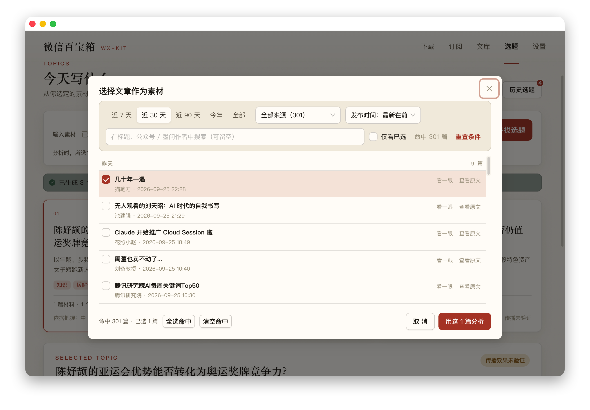
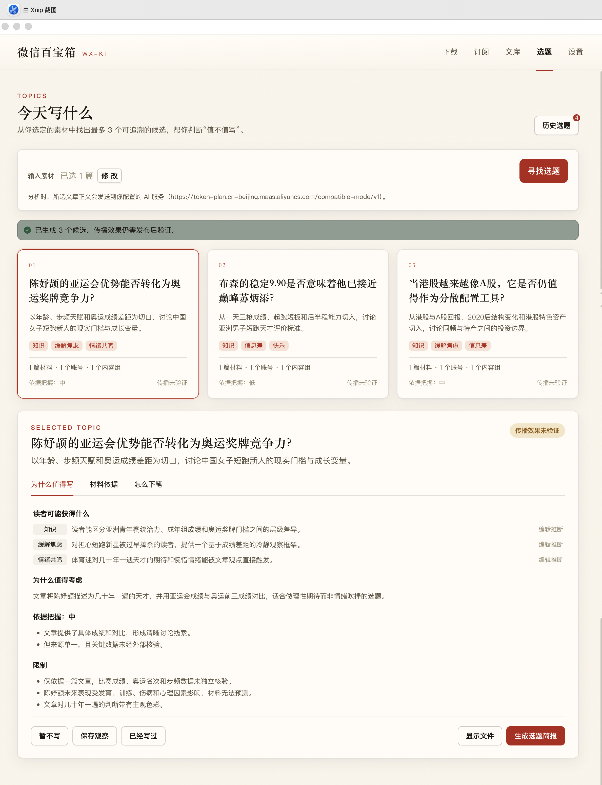
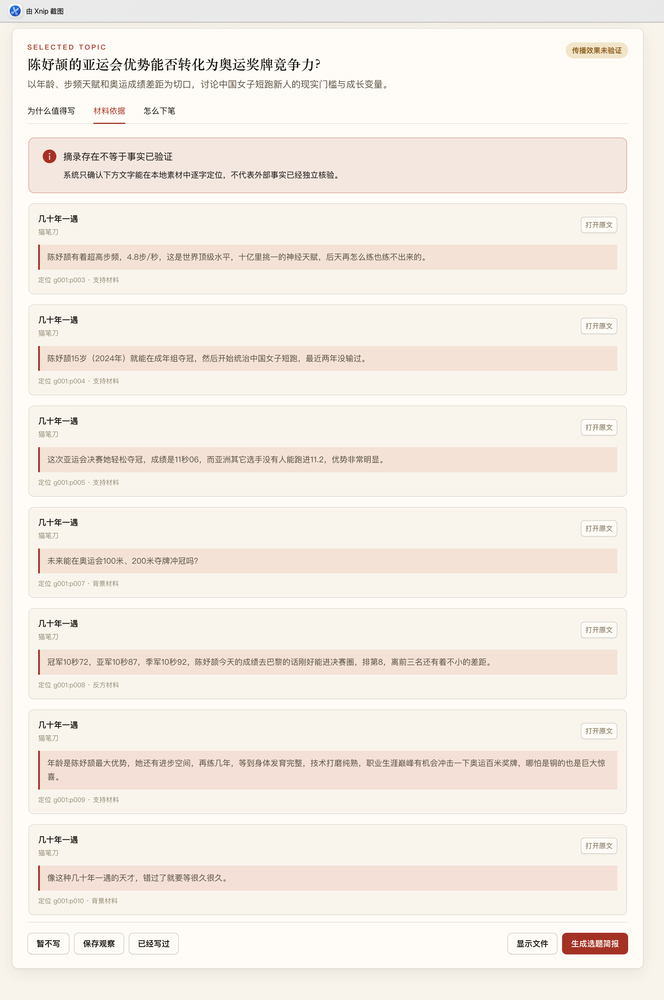
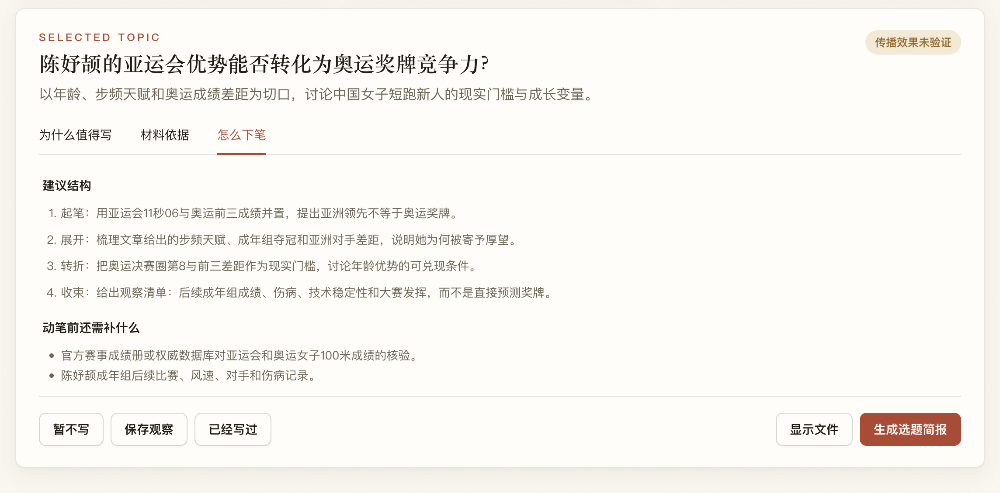

# 收藏了很多文章，下一篇写什么？

做内容的人大概都经历过这个过程。

看到一篇文章，觉得有用，先存下来。看到一个观点，觉得以后可能用得上，也存下来。时间久了，文库里的素材越来越多。

但真到自己准备写点东西的时候，还是会卡住。

这些材料里，哪些值得继续挖？它们之间有没有能连起来的角度？如果要写，第一段从哪里开始？

文章存下来，只是第一步。

所以在 wx-kit v0.12.0 里，我给文库加了一个选题工作台，想把「素材已经有了，下一篇写什么」这一步也接起来。

用法很直接，在选题页里从文库选文章，点「寻找选题」。wx-kit 会根据这些材料整理出最多三条候选。每条都有推荐理由、材料依据和起笔结构，你可以自己判断要不要继续。

这次我拿本机文库里发表时间最新的一篇文章，单独跑了一轮。文章叫《几十年一遇》，当时在文库里的发表时间是 9 月 25 日 22:28。只选这一篇，系统给出了三个方向。

第一条围绕陈妤颉，讨论亚运会的优势能不能转化为奥运奖牌竞争力。第二条把布森稳定的 9.90 和巅峰苏炳添放在一起，讨论评价短跑运动员时，稳定性和单场成绩该怎么看。第三条则转向港股，追问当港股越来越像 A 股，它还适不适合作为分散配置工具。

三条里，我最想展开看的是陈妤颉那一条。点开「材料依据」，能看到原文里支持这个角度的段落，也能看到提醒读者保持谨慎的材料。比如一边是文章对步频和年龄优势的描述，另一边是它把当前成绩放到巴黎奥运成绩中比较，指出离前三仍有差距。

这里有个我很在意的设计，页面会把原文摘录定位到具体段落，同时明确提示「摘录存在不等于事实已验证」。它只保证这句话确实出现在所选材料里，不替文章里的成绩、数据和判断背书。这个例子只有一个来源，候选卡也如实显示材料来自一篇文章、一个账号、一个内容组。第二条候选的依据把握还被标成了低。

这组结果当然不是三条都能直接拿去写，也不代表 AI 替我选好了题。第三条切到港股配置，我还得回看原文，判断这个方向跟材料的关系够不够紧。选题卡给我的，是几个可以继续核对的入口，不是最终结论。

我觉得这正是它应该做的事。大模型很容易给出一个听起来完整的标题，难的是让人看清它从哪里来、有什么依据、还缺什么。候选选题点开后，还有「怎么下笔」这一页，会把文章的起笔、展开、转折和收束整理成结构；同时列出动笔前还需要补的资料。

这次更新也补上了选题之后的管理。每轮分析会保存在历史里，之后能回看、继续记录「暂不写」或「保存观察」，也能生成 Markdown 简报。选素材时可以按时间、来源和发布时间排序，不必只靠一个搜索框猜文章在哪。

模型设置方面，wx-kit 支持智谱、千问、DeepSeek、Kimi、MiniMax、OpenAI、Google 和自定义服务。分析过程会实时显示，也可以随时取消。CLI 也能调用选题分析，方便脚本和 agent 接着处理。

这里需要把数据边界说清楚。选中的文章正文会发送到你配置的模型服务。API Key 可以加密保存在本机；如果系统加密不可用，只在当前会话中使用，不会降级成明文保存。不想把素材正文发送给外部模型，就不要在选题页提交分析。

wx-kit 不会从全网抓热点，也不承诺哪个题目能火。它使用的是你选中的本地素材，帮你整理出值得进一步判断的方向。事实要不要采信、材料够不够、题目值不值得写，最后仍由作者决定。它也不负责代写整篇文章。

v0.12.0 还修复了 Windows 阅读器里的图片和封面无法显示的问题。从下载文章，到管理素材，再到从素材里找选题，wx-kit 现在多接上了创作前面的这一步。

如果你已经在用 wx-kit，可以更新到 v0.12.0，在「选题」页试试。新用户可以从 [GitHub Releases](https://github.com/monkeychen/wx-kit/releases/tag/v0.12.0) 下载 macOS 或 Windows 安装包。

选题还是你来定。

至少这一次，面对文库时可以先有几个方向，再决定从哪里动笔。
