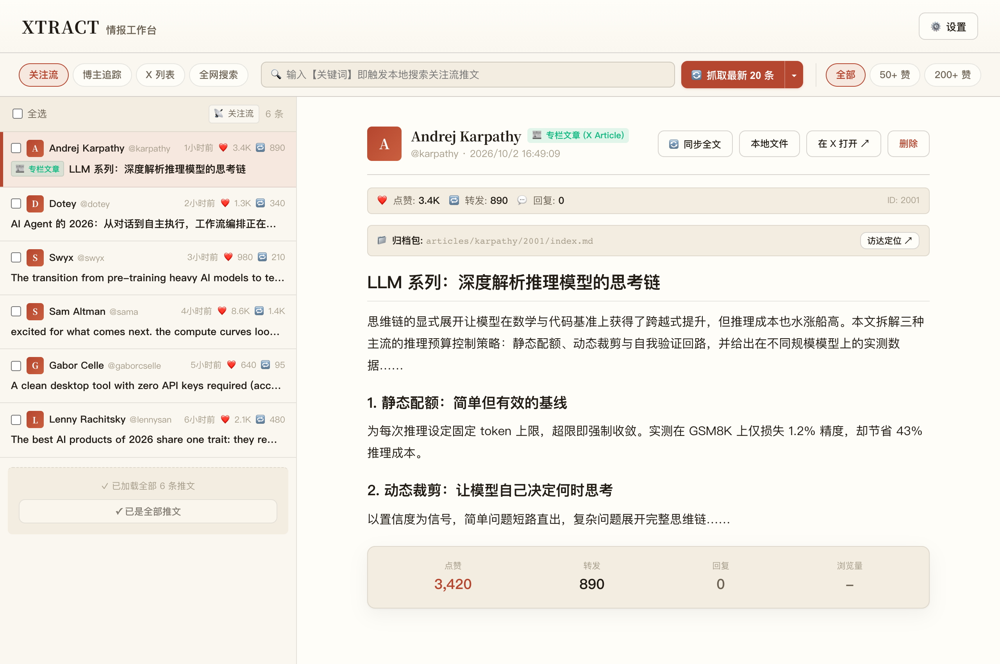

这几天，我又开发了一个工具，叫 xtract。

它做的事情很具体。从 X，也就是以前的 Twitter，收集你关注的内容，保存成方便阅读和检索的资料，也能导出，再按需要交给 AI 整理成简报。

我想先把它介绍给写文章、做视频的人。平时读到一条值得留意的讨论，收藏下来只是第一步。等到真要写稿，还得找回原文，确认作者当时在谈什么，把自己的判断和别人的话分开。xtract 目前先帮人处理其中的采集与整理。

本文按 2026 年 10 月 2 日已发布的 v0.1.1 来介绍。macOS 的 Apple Silicon 版和 Windows x64 版都有安装包，可以直接装桌面应用。[下载页面](https://github.com/monkeychen/xtract/releases/tag/v0.1.1)

## 把内容抓回来以后

xtract 有四种采集入口。你可以读取自己的关注流，也可以输入一个作者的账号，抓取他的近期内容。长期跟踪某个领域时，X 列表更方便，把相关账号编进同一个列表，资料就能按这个范围收集。临时准备一个题目，则可以用关键词在 X 上搜索。[项目介绍](https://github.com/monkeychen/xtract)

这里能拿到多少内容，取决于账号能看到什么、页面实际加载了多少。选择抓取五十条，表示这次采集的上限。工具也要跟着 X 的访问限制和网页变化调整，这一点得讲清楚。

*工作台图片取自项目文档，画面中的账号内容和互动数字是演示数据。*

工作台左边是内容列表，右边可以直接读选中的原文。找到值得细看的长推文或 X Article 专栏，可以同步全文，保留文章里的标题和配图。作者在下面追加的回复也有采集选项，需要时在设置里打开。[采集与阅读说明](https://github.com/monkeychen/xtract/blob/main/docs/cli-reference.md)

默认只采集长推文和专栏，方便攒深度阅读的资料。做资讯的人可以在设置里关闭这个限制，免得漏掉只有几句话的产品公告。点赞门槛也可以调，先看传播较多的内容，但刚发出来的消息和小账号的好文章，仍然值得单独留意。

有用的内容可以导出成 Markdown。每篇归档会记录作者、发布时间和原文链接，成功下载的配图跟正文放在一起，搬到别的目录后仍然能正常引用。视频目前保留在线播放链接。[归档与媒体说明](https://github.com/monkeychen/xtract/blob/main/docs/cli-reference.md)

对写作者来说，这些小信息很有用。你回头引用一段话，能找到说话的人，也能打开原文核对前后文。以后换笔记软件，导出的文档还可以继续用。

AI 整理放在采集之后。先抓取、存进本地，再决定是否生成早报。报告会按主题梳理推文，提炼长文要点，也会尝试给出选题建议。英文内容可以整理成中文重点。趋势报告则从 X 的趋势话题出发，搜索相关讨论，再生成一份报告。[报告生成方式](https://github.com/monkeychen/xtract/blob/main/src/main/pipeline/summarizer.ts)

只采集资料，不会调用大模型。重新生成报告仍然会调用模型，也会消耗相应额度或费用。资料保存在电脑里，使用云端模型整理时，参与整理的文本会发给所选服务。xtract 可以接 Gemini、DeepSeek 等模型服务，具体用哪一家，由使用者配置。[模型调用实现](https://github.com/monkeychen/xtract/blob/main/src/main/llm/index.ts)

我更愿意先把 AI 报告当成阅读提示。它能帮人快速找到值得打开的几篇原文。报告里的一条判断要写进自己的文章，还得核对原文，有必要就继续找产品文档或当事人的说明。

## 下一篇稿子可以从这里开始

如果准备写一篇 AI 产品更新的文章，可以先建一个 X 列表，把产品官方账号和相关开发者放进去。公告发出以后，采集列表里的新内容，再用产品名搜索使用者的反馈。

这样能放到一起看的材料，既有发布方的说明，也有别人试用后的意见。有人说好用，有人遇到问题，回到原帖看看他们各自做了什么、用了哪个版本。之后自己复现关键步骤，再去写它适合谁、有哪些条件。

这条流程里，xtract 负责找回讨论和保存资料，试用与判断要由作者做。具体任务失败在哪一步，往往比一张热闹的发布海报更值得写。

*采集、归档和 AI 简报属于 xtract 当前能力。图中的核验、选题及写作由创作者和外部工具完成。*

长期跟踪一个人，也能做出另一类内容。

选几位自己关注的开发者或行业作者，持续保存他们公开发出的长文。要写一篇人物观点梳理时，可以按发表时间对照原文，看看他在什么条件下提出一个判断，后来有没有补充或修正。

时间得留着。把两年前的话和今天的环境放在一起，容易误解对方。归档里的发布时间和原文链接，正好让这件事有地方可查。现在的时间线需要自己整理，后续可以考虑让工具帮忙。

再往前走，可以做同一事件的多方讨论稿。关键词搜索拿回相关推文，挑出提出不同判断的作者，把他们的依据放在一起。一个观点被转发很多次，只能说明传播得广。几个人各自提供了不同的测试、文件或亲历信息，才多了可用的材料。资料里有什么就写到哪里，空缺也可以留着，成为下一次采访或测试要问的问题。

做培训的人还能从里面挑教学案例。

假如准备讲一节 AI 工作流的课，可以从一篇开发者的操作长文开始。保存原文，顺着里面的项目链接找文档，自己试一遍，再整理出学员能跟着完成的练习。案例里用到哪些条件，哪里容易失败，讲清楚之后，课堂上才有东西可做。

这比只讲一个产品名称多走了几步。xtract 能减少找原文、收配图的重复操作，老师仍然要把案例跑通。

也可以把这些归档放进支持 Markdown 的笔记工具，跟自己的采访笔记、公众号资料一起整理。以后要写一个题目，先找手里已经读过的东西，再决定缺什么，需要继续去哪里找。当前需要自己导入和组织这些文件，与其他资料工具联动的部分还在规划里。

## 接下来，我更想先补这些地方

项目现有的 v0.2.0 路线图，已经列了语义检索、后台定时采集与通知，以及和 Astro、wx-kit 的联动。它们目前都属于规划。[现有路线图](https://github.com/monkeychen/xtract/blob/main/docs/prd/v0.2.0.md)

如果从内容工作者的需要继续往下做，我会把下面几个方向排到前面。这些是迭代建议，具体进入哪个版本，还要看实际使用反馈。

先补选题卡和出处管理。

看到一段值得写的内容，选中原文就能建一张卡，写下自己想回答的问题。卡片里保留原帖链接，附上引用片段，再记一句为什么值得写。之后补进新的资料，标记还没确认的地方。写稿时打开这张卡，就知道手里有什么，以及下一步该查什么。

引用片段和 AI 总结要分开放。别人原话里有条件，摘要里漏了这个条件，读者就可能得到另一个意思。工具应该让作者很容易来回核对。

接着做同一事件的合并和进展提醒。

现在按推文 ID 去重，能避免反复保存同一条推文。同一场发布被几十个人讨论，仍然会有几十条不同的内容。后续可以把它们归到一个事件下，先列已经知道的事实，再显示这次多出来的实测或反对意见。

定时巡检也适合接在这里。一个话题没有新材料，就保持安静。有了可用的新来源，再提示正在跟踪它的人。每天打开工具，先看自己关心的事情发生了什么变化，阅读量会更容易控制。

双语对照阅读也值得做。

读英文长文时，一边看原文，一边看对应的中文译文，点一下就能回到原段落。专业词可以沿用自己的词表，引用时保留原文与翻译的区别。现在的中文简报已经能帮人粗读，逐段核对翻译还能继续减少误读。

语义检索和跨资料搜索，则适合用来找旧内容。

有时记得一篇文章讲过怎样处理某个问题，却想不起它用了哪个词。可以直接描述那个问题，让工具找出相关归档，并指到支持答案的原文段落。如果再和 wx-kit 保存的中文文章打通，同一个问题就能同时找到两边的材料。这个方向与现有规划相符。先拿真实资料试。

等资料组织得顺手了，再做面向不同作品的素材包。

选中一组资料，准备写公众号长文，就整理出可讨论的问题和引用清单。准备录视频，则提取适合演示的操作步骤，列出还缺的画面。作者可以据此搭提纲，再加入自己的测试和判断。AI 没找到依据的地方，应该直接留空。

最后可以试着记录作品发表后的反馈。

这张选题卡后来写成了哪篇文章，可以把链接记回去。读者没看懂的地方、评论提出的新问题，也能留在旁边，下次跟进这个题目时接着回答。阅读量可以参考，读者留下的具体问题往往更有用。

这些方向里，我更想先试选题卡和出处管理。它们离一次真实的写作很近，也比较容易验证。拿一组已经归档的材料准备一篇稿子，记下找不回原文的地方，留下待查的问题。稿子写完后，再核对一次引用清单。

如果你平时就在 X 上找资料，可以先从一个已有列表开始，抓一批近期内容，选几篇真正想读的长文，再导出其中值得保留的材料。

项目已经开源，源码和使用文档放在 [xtract 项目主页](https://github.com/monkeychen/xtract)。第一次配置需要准备能访问 X 的网络和自己的 X 登录态。macOS 可以从 Chrome 导入，Windows 目前需要手动填入 Cookie；只做采集可以先不配置模型，想生成 AI 报告时再接入。[配置说明](https://github.com/monkeychen/xtract/blob/main/docs/configuration.md)

也欢迎把你做内容时反复碰到的小麻烦提到项目里。最好能说清正在准备什么作品，哪一步最费时间。我想先从这些具体的地方继续做。
