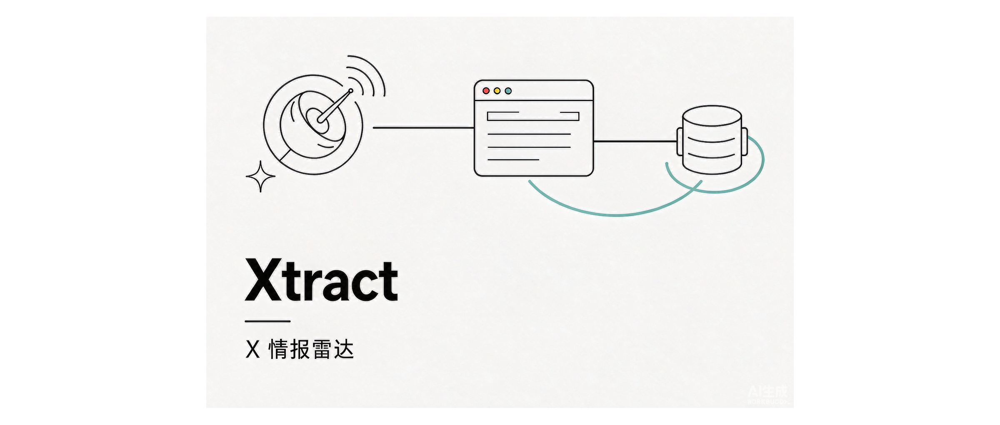
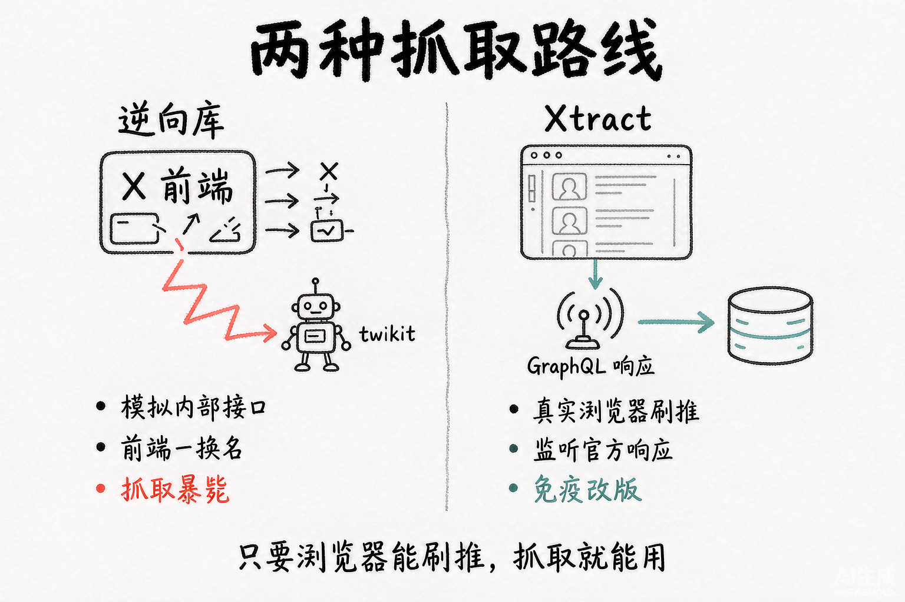
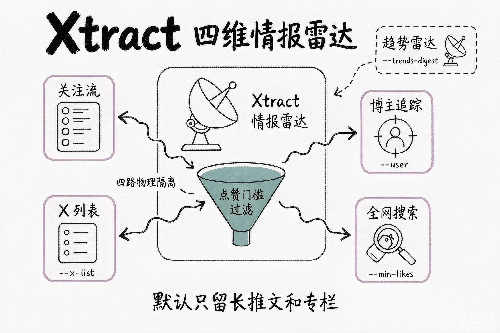
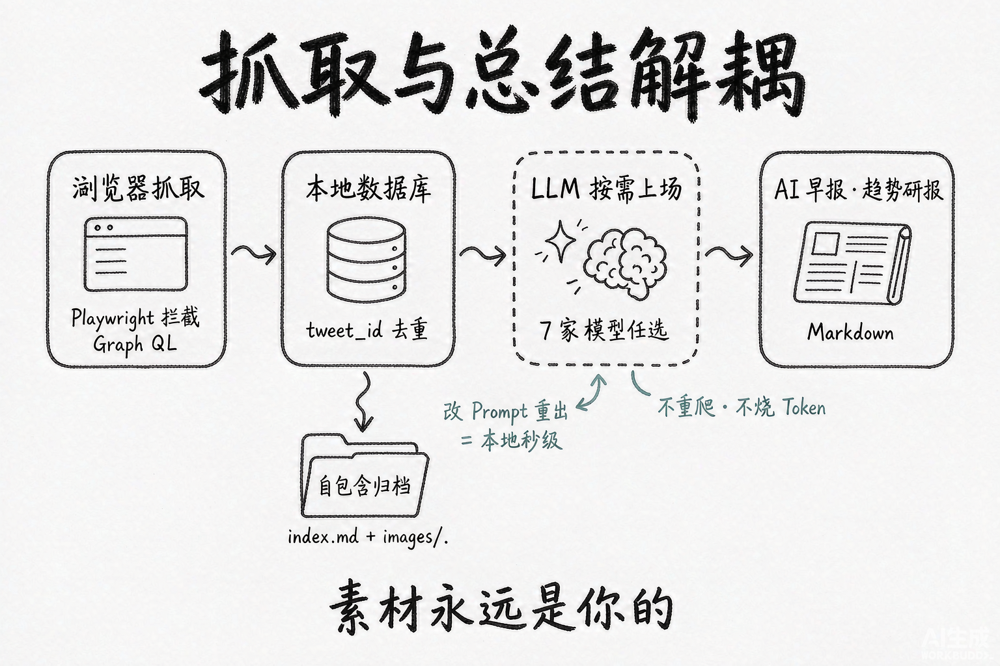
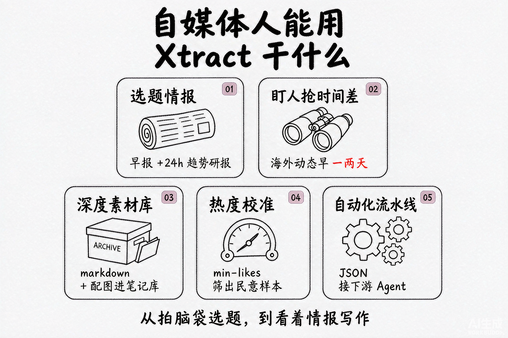
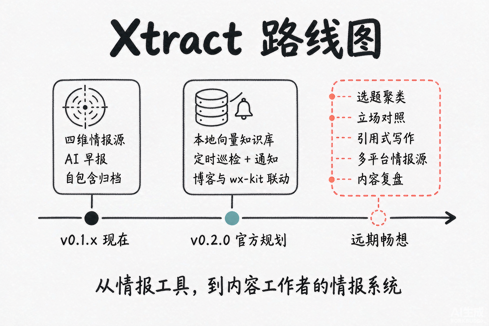

前几天我把一个新工具挂上了 GitHub，叫 Xtract。它替我干一件事，每天把 X（Twitter）上值得看的内容抓回来，滤掉水帖，再让大模型整理成一份能直接读的早报。做它的起因说起来有点烦，我之前用过的那些 X 抓取库，全都活不长。

问题出在技术路线上。市面上大多数 X 爬虫走逆向，twikit 这类库自己模拟 X 前端的内部接口。X 的前端每重构一次，打包命名换一轮，这些库就集体暴毙，作者追着修，用户跟着等。做 Xtract 的时候我把方向整个换掉了。用 Playwright 驱动一个真实浏览器去刷推，在协议层监听 X 官方前端自己发出的 GraphQL 响应。前端爱怎么改怎么改，它自己总要向后端要数据，我就守在数据回来的那条路上。所以只要你的浏览器还能正常刷推，这套抓取就一定能用。

## 一份代码，两种形态

不带参数启动，它是一个 Electron 桌面应用，打开就是情报工作台，几路情报源切换，长文沉浸阅读，视频免落盘流式播放。带上参数启动，它变成命令行，stdout 吐标准 JSON，可以直接接进终端管道和下游 Agent。桌面版和命令行是同一个程序，装个 DMG 或 Windows 安装包就能跑，不装 Node，不装 pnpm，不用碰任何开发环境。

macOS 首次打开可能被 Gatekeeper 拦一下，右键选打开就行。Windows 没有代码签名，SmartScreen 提示时点「仍要运行」。登录 X 也不用开开发者工具翻 Cookie，设置中心有一键登录，macOS 还能直接从 Chrome 读登录态。

情报源有四路。关注流是你自己的 timeline。博主追踪盯住指定的人，一句 `xtract --user karpathy` 就把他的推文抓全。X 列表适合把同领域的账号编成组。全网搜索按关键词实时查，还能叠点赞门槛，`--search "AI Agent" --min-likes 50` 只留有点热度的讨论。四路之间物理隔离，互不串扰。水帖由点赞门槛层层滤掉，默认只留下长推文和专栏文章。

另外还有一块趋势雷达。`--trends` 是全网实时热搜看板，`--trends-digest --hours 24` 更进一步，自动把过去一天的趋势跑成一份深度研报。

## 我最在意的一个设计

抓取和总结是分开的两步。推文抓回来，先落进本地 SQLite，按推文 ID 去重，大模型只在你要看的时候才上场。

这个解耦带来的好处很实际。Prompt 不满意，改一句重出一份早报，是本地秒级的事，不重爬，也不烧 Token。抓过的每一条都在库里，三个月后想翻某个博主当时怎么说，直接检索本地数据。归档也是自包含的，每篇推文导出成一个文件夹，`index.md` 加同级配图目录，不依赖任何外部服务。哪天你不想用 Xtract 了，素材还是你的。

模型这块做了统一调度，Gemini、OpenAI、DeepSeek、千问、智谱、MiniMax、Kimi 七家任选。认证走双轨，有 API Key 用 Key，没有 Key 就走账号订阅通道，用网页版订阅的额度。所有数据都落在本地，SQLite 主库加原始 GraphQL 快照备份，凭据文件不进版本库。

工程质量上我没有糊弄。三百多项自动化测试全绿才允许交付，其中包含十几条用真实浏览器跑起来的端到端流程，一条 `pnpm verify` 跑完所有门禁。协议是 Apache-2.0，商用和二开都行，保留版权声明就好。

## 做自媒体的，能拿它干什么

这部分是我写这篇文章真正想聊的。Xtract 表面上是个程序员工具，拆开看，它解决的几个问题，恰恰是内容工作者每天都撞上的。

先说选题。做内容的人每天醒来面对两个问题，今天写什么，大家已经聊到哪了。Xtract 的早报管第一个，趋势研报管第二个。`--trends-digest --hours 24` 跑完，过去一天全网在吵什么、哪个话题在升温，摆在面前。选题这件事就从拍脑袋变成了看情报，你不一定跟着热点走，但至少知道热点在哪。

再说盯人。海外 AI 圈的动态，大半先在 X 上冒头。从 karpathy 这种人的一条推文，到国内媒体跟进，中间往往隔着一两天。博主追踪把这个时间差变成你的。配合大模型的整理和翻译，别人还没刷到原文的时候，你的解读可能已经写了一半。做编译类、资讯类账号的，光这一个功能就值回折腾的成本。

第三是素材库。默认只留长推文和专栏，正好都是深度内容的来源。归档出来是 markdown 加配图，扔进 Obsidian 或任何笔记软件都能直接用。写长文的时候，按作者按时间翻自己攒下的东西，比临时全网搜要可靠得多。

第四是热度校准。一个话题值不值得做，光凭感觉容易偏。用 `--min-likes` 把搜索门槛抬高，留下来的讨论可以当民意样本，评论区里吵的角度，往往就是读者最想看的角度。

最后一点给会折腾的人。CLI 输出标准 JSON，意味着它可以接进任何自动化流水线。我自己的玩法是定时任务每天抓完出早报，再交给下游 Agent 处理。一个工具的价值，有一半在它留给别人的接口上。

有一句提醒得放在这里。抓回来的是素材和情报，不是可以原样搬运的成品。引用别人的推文，注明作者和出处，这是底线。

## 后面还能做什么

Xtract 现在的版本是 v0.1.x，v0.2.0 的规划已经写在仓库里，方向是从情报工具往知识库走，一共三块，本地向量语义知识库，后台定时巡检加系统原生通知，还有和 Astro 博客、微信百宝箱的联动。在这个基础上，我列几条更远的想法，也算给关注这个项目的人一个预期。

一是选题聚类。向量知识库解决的是找得到，下一步该是看得见。把一段时间抓到的推文按主题自动聚类，每个主题带热度曲线和代表人物，一张图看完这周 AI 圈在吵什么。对内容团队来说，这张图就是选题会。

二是立场对照。同一个事件，不同博主的说法经常打架。把同一话题下的观点按立场分组摆在一起，谁支持，谁反对，各自的理由是什么，一目了然。速报和深度稿的差距，大半就在有没有把几方的说法都摆出来。这个功能做出来，等于给每篇深度稿备好了骨架。

三是引用式写作辅助。写草稿提到某个观点，工具自动附上原推链接和本地归档。写过东西的人都知道，回头找出处是最烦的活之一，也是最不该出错的活。

四是多平台情报源。X 只是其中一路。Hacker News、RSS、Reddit 都可以接，微信公众号的内容理论上也能走类似的思路。情报源每多一路，雷达的盲区就少一块。

五是内容复盘。把自己发过的文章也喂进库里，和抓到的热帖对照。你写过的哪类选题后来真成了热点，哪类自嗨到底，有了这层对照，选题判断会越用越准。

这五条有先后。聚类和立场对照管选题，引用辅助管写作速度，多平台源扩大视野，复盘校准判断。它们拼起来才是我脑子里这个东西的完整样子，一个内容工作者的情报系统，抓回来的有推文，也有选题、素材和判断的依据。

项目地址放在这里，https://github.com/monkeychen/xtract ，文档写得很全，安装包在 Releases 页。觉得有用欢迎 star，遇到问题欢迎提 issue，尤其是 Windows 的安装和快捷方式配置，很需要真实用户的反馈。
