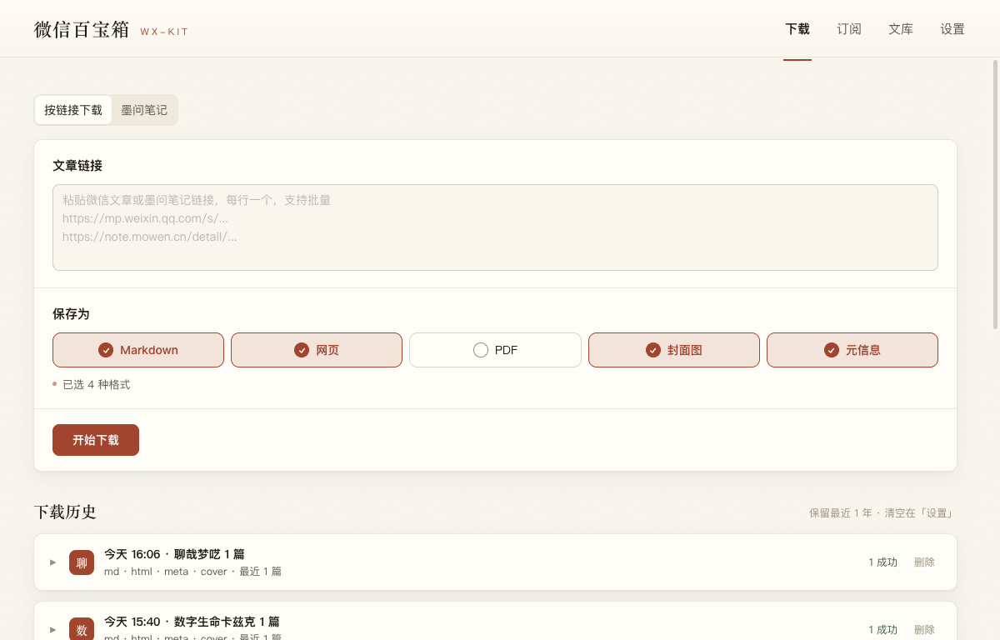
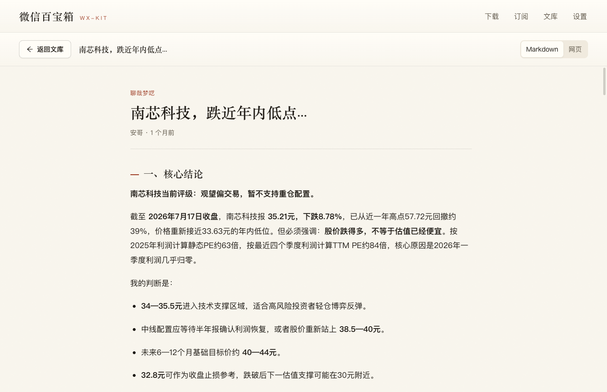

## 解决什么问题

你在微信里收藏的文章，其实并不属于你：作者删文、平台限流、账号注销，它就没了。wx-kit 做一件朴素的事——**把公众号文章下载成实实在在的本地文件**，不依赖任何人的服务器继续存在。

另一个初衷：想把一批文章喂给 AI 做分析整理时，不再一篇篇人肉复制粘贴。

## 核心功能

- **多格式下载**：粘一条或多条文章链接 → Markdown / 网页 / PDF / 元信息 / 原始 JSON 任选，图片和视频自动本地化，图床挂了也不裂图
- **本地文库 + 阅读器**：下载的文章按来源分组存在本地（默认 `~/Documents/wx-kit/`），可搜索、排序、切换卡片/列表视图，应用内直接阅读（书页式 Markdown 排版或原文网页视图），离线可读
- **订阅自动拉新**：订阅公众号或墨问作者，应用开着时后台定时检查新文章，按策略「自动下载」或「仅提示」；每轮检查白纸黑字留痕，不做黑盒
- **墨问笔记**：支持公众号之外的第二个内容源——墨问笔记。粘链接直下（匿名接口，零配置）；装官方 `mocli` 后解锁按作者/关键词搜索、批量下载和作者订阅。笔记里引用的其他笔记渲染成内联卡片，付费子笔记如实标注
- **给 AI 用的 CLI**：同一个程序内嵌命令行模式，输出纯 JSON（stdout 走数据、stderr 走进度、退出码区分成败），AI agent 可以直接调用它下载、检索、管理文库和订阅

## 怎么获取

- **macOS**：`brew install --cask monkeychen/wx-kit/wx-kit`，或去 [Releases](https://github.com/monkeychen/wx-kit/releases) 下载 DMG（Apple Silicon / Intel 分开）
- **Windows**：Releases 下载 `wx-kit.Setup.x.x.x.exe`，与 macOS 版功能一致
- **npm**：`npm install -g @simiam/wx-kit`（同一个 Electron 应用包）

完整上手指南（含截图）见[用户手册](https://github.com/monkeychen/wx-kit/blob/main/docs/USER_MANUAL.md)。

## 设计边界（明说在前）

- **不做按公众号批量下载历史文章**——微信侧列表接口已被服务端按账号封禁（跨平台实测都封），与其留一个不可靠的按钮，不如撤掉。替代方案是订阅：单号订阅，后台持续拉最新
- 订阅只在电脑开着、应用开着时运行，没有 7×24 后台服务器；登录态过期会明确提示，不装死
- 不装根证书、不改系统代理、不碰系统底层——宁可功能弱一点
- 安装包未做签名公证：macOS 首次打开需手动允许，Windows 遇 SmartScreen 选「仍要运行」

## 技术与开源

纯 Node + Electron 单进程，无 Python 边车、无数据库（文件系统 + JSON 索引）。**Apache-2.0 开源**，全部代码、设计文档和每一程的复盘日志都在仓库里。

这个工具从需求到上线是与 AI 结对完成的：[我做了个小工具，把公众号文章从围墙里捞出来，顺便喂给AI](/posts/wx-kit-intro/)；接口被封后如何砍功能、又把工具一点点救回来，记录在[迭代历程](/posts/wx-kit-v0-11-2/)。
