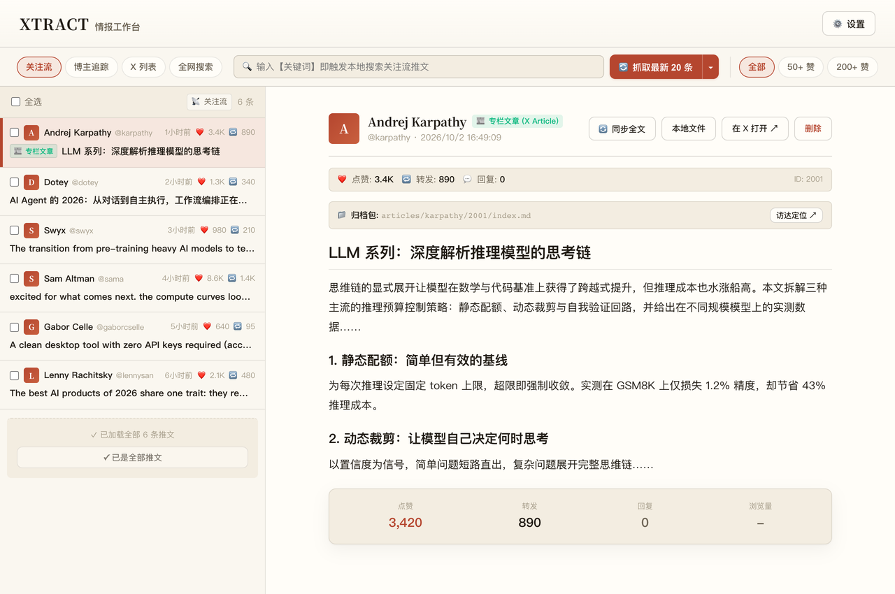
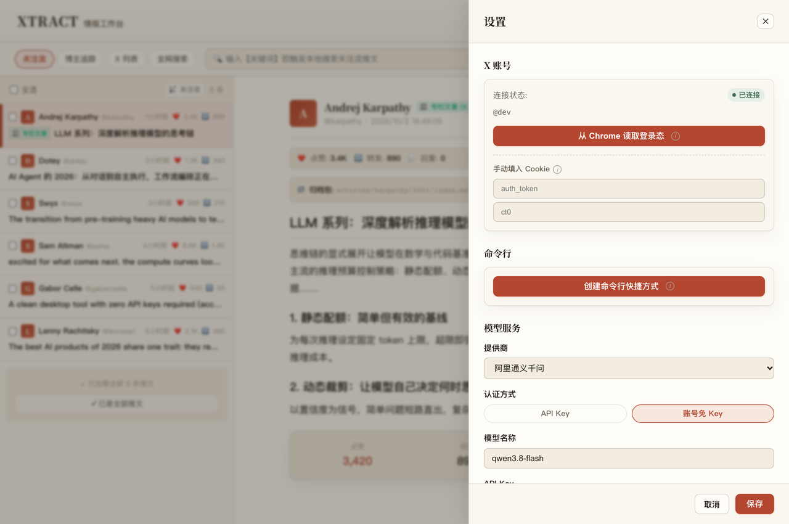

## 解决什么问题

市面上大多数 X 抓取工具走逆向路线：twikit 这类库自己模拟 X 前端的内部接口。X 官方每次重构前端、打包命名换一轮，这些库就集体暴毙，作者追着修，用户跟着等。

Xtract 反过来做：**用 Playwright 驱动一个真实浏览器去刷推，在协议层监听 X 官方前端自己发出的 GraphQL 响应**。前端爱怎么改怎么改，它自己总要向后端要数据——只要你的浏览器还能正常刷推，抓取就一定能用。

## 核心功能

- **四维情报源**：关注流 / 博主追踪 / X 列表 / 全网搜索，四路之间物理隔离互不串扰
- **高信噪比过滤**：点赞门槛全链路过滤水帖（`--min-likes`），默认只留长推文与专栏
- **抓取与总结解耦**：推文先落 SQLite 按 `tweet_id` 增量去重，LLM 按需上场——改一句 Prompt 重出早报是本地秒级操作，不重爬、不烧 Token
- **AI 早报与趋势研报**：抓取结果一键生成 Markdown 早报；`--trends` 是全网实时热搜看板，`--trends-digest --hours 24` 自动把过去一天的趋势跑成深度研报
- **自包含归档**：每篇推文导出为 `output/{作者}/{推文ID}/index.md` + 同级配图目录，不依赖任何外部服务，素材永远是你的
- **7 大模型统一调度**：Gemini / OpenAI / DeepSeek / 千问 / 智谱 / MiniMax / Kimi，API-Key 与账号订阅免 Key 双轨认证
- **一份代码两种形态**：不带参数启动是 Electron 桌面工作台；带参数进入 Headless CLI，stdout 输出纯 JSON，可直接接终端管道和下游 Agent





## 怎么获取

- **macOS (Apple Silicon)**：[Releases](https://github.com/monkeychen/xtract/releases/latest) 下载 DMG，首次打开被 Gatekeeper 拦截时右键 → 打开
- **Windows x64**：Releases 下载安装包，SmartScreen 拦截时选「更多信息 → 仍要运行」

安装后打开应用 → ⚙️ 设置 → 「从 Chrome 读取登录态」配置凭据 → 「命令行」区一键创建 `xtract` 命令，之后终端里直接用：

```bash
xtract --fetch-only --report-only        # 拉取关注流 + 生成早报
xtract --search "AI Agent" --min-likes 50  # 关键词全网实时搜索
xtract --trends-digest --hours 24        # 全自动趋势深度研报
```

完整命令手册见 [docs/cli-reference.md](https://github.com/monkeychen/xtract/blob/main/docs/cli-reference.md)。

## 设计边界（明说在前）

- 浏览器登录态一键导入仅支持 macOS，Windows 用户在设置里手动填入 Cookie
- 抓取 X 需要本地可用的网络代理，这是前提不是可选项
- 安装包未做代码签名公证，首次打开需手动放行
- 不碰系统底层：不装根证书、不改系统代理

## 技术与开源

TypeScript + Electron 34 + Node.js 22+，Playwright 持久化浏览器配置，SQLite 单文件存储（原始 GraphQL 快照同步备份，便于回溯）。**Apache-2.0 开源**，`pnpm verify` 一键门禁覆盖 280+ 用例，含 18 个真实浏览器端到端流程。

这个工具从设计到实现是与 AI 结对完成的：为什么换掉逆向路线、它能为内容工作者做什么、v0.2.0 往后还能长成什么样，都写在这篇里——[我做了个 X 情报雷达，这回它不会再暴毙了](/posts/xtract-radar/)。
